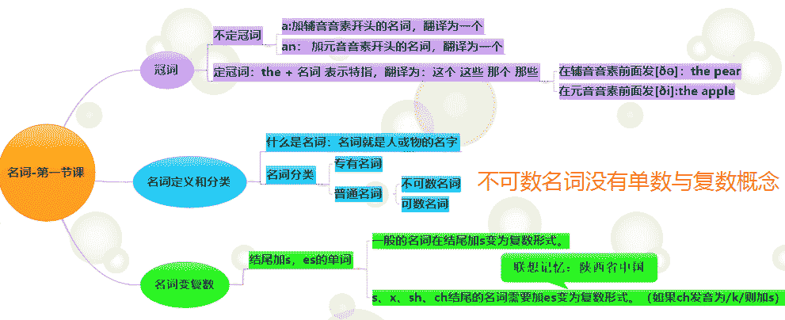
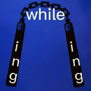

# 英语语法

英语语法是什么呢？

是帮助你快速fast的掌握英语的一个工具。注意了哦！是“工具”，也不要太依赖于语法。

## 名词

- 什么是名词？

  天地混沌之初，到处都是一片......额.........叫不上名来，我们就叫混沌吧。也可以叫其它任意。这就是名词。

  **无名万物之始，有名万物之母**

  世间万物没有名字的时候就是万物开始的时候。......当我们创建名字。就有了创造的能力。

  手机、电脑......

### 不可数名词

- 不可数名词有哪些呢？

  我随便来些吧！算了我学的口诀太多了，我记了又记太多没有记住，什么金木水土火...面包...牛奶....，老天爷啊，这是语言！
  
  来我一句口诀体验一把，让你记住记牢不可数名词怎么去区分，口诀：取一部分，它还是它。
  
  不可数名词定义：
  
  - time 时间，取一部分时间，是什么？还是时间。 不可数。
  - money 钱，如：一个亿，取一元，不还是钱，本质没有改变， 不可数。
  - water 水，如，水中取一点，取的不还是水。
  - sand沙漠，如在沙漠里面取点，不还是沙。
  - fruit水果【统称时不可数】取出苹果，还是水果。
  - vegetable蔬菜。
  - bread：面包，取出一点是什么？面包
  - fish:表示鱼肉是表示不可数，因为：在鱼肉里面取点还是鱼肉。
  
  可数特殊的单词：
  
  - 我家小院里面中了3中水果，4中蔬菜，时就是可数。【种类可数】
  - cake：蛋糕，为什么呢，你取一点可能不是蛋糕，可能有水果、奶油、....
  - fish：鱼。鱼有、鱼头、鱼尾、鱼身体、....

## 定语&状语

猴子  在狗窝  打[谓语]  狗子[宾语]

谓语：打是宾语，表示动作“打"。

宾语 :  打狗子，狗子：是宾语。

- 打什么样的狗子呢？

猴子  在狗窝[状语]  打[^谓语]  笨[定语]  狗子[^宾语]

定语：打笨狗子，这个笨，就是定语了。

状语：在狗窝，表示：地点。也叫地点状语。

- 什么是定语？

  定语就是给人和事物下定义。

- 什么是状语？

  指动作发生的时间、地点等。

A monkey beats a stupid dog in the kennels.

猴子打 一个笨狗子，在狗窝。

语法解析：

1. beats ：beat【打】第三人称单数形式。
2. stupid：愚蠢的，定语部分。【这里定语修饰的是名词dog狗】
3. in the kennels：地点状语，在狗窝。

::: tip 小结：中文&英文的定语、状语在句子中的位置有什么不同？

<strong>不同点：在状语</strong>

- 英语

  英语将状语的位置放在了句子的最后面。

- 中文

  汉语它将状语放在了中间。

<strong>相同点：在定语，中英都没有什么变化，都一样。</strong>

- 上面的案例：定语修饰了名词dog。

:::

## 01）When/While引导时间状语从句

口诀：

双节棍：必用**while**

咔嚓嚓：必用**when**

必知一：while后面只能接延续性的动词。

必知二：when大多数情况下都能使用，原因：when即可接延续性的动词，也可以接非延续性的动词。

### 用while情况

- <b>考察一：</b>延续性动词，通常以进行时的形式来考察。【用while】

  

  I was watching TV 【while】 my brother was writing an E-mail.
  
  我正在看电视，而我哥哥正在写电子邮件。

### 即可用when/while情况

- <b>考察二：</b>前面不是延续性动词，后面是延续性动词的时候。【可以填when/while】

  Someone knocked at the door 【while/when】  I  was cooking.

  ::: details 译文

  \- 解释：有人正在敲门，（什么时候）我在做饭时。

  :::
  
  没有状语的句子。
  
  omeone knocked at the door 【看上去奇怪吧，是不是感觉缺了什么吧！】

::: danger 前面有while时

后面必须接进行时。 

:::

### 用when情况

- <b>考察三：</b>咔嚓嚓情况。前面是，后面是短暂行的动词。必用when！

  We were having a meeting 【when】 someone broke in.

  ::: details 译文

  \- 解释：我们正在开会，突然有人闯入。

  :::

  ::: danger 注意

  having 是【动词】

  a meeting：名词，表示会议，因为：不能有二个动词！ 

  :::

- <b>考察四：</b>前面短，后也短。【必用when】

  We were <b>about to</b> go out 【when】 it suddenly began to rain.

  ::: details 译文

  \- 解释：我们正要出门，突然下起了雨。

  :::
  
  ::: danger 注意
  
  about to 将要
  
  go out 外出
  
  :::

### 练习

When I saw Jimmy, he was wearing a green shirt.

I was doing my homework, while Allen was cleaning his room.

While he was reading (read), suddenly the telephone rang.

read用现在分词

::: tip 小结：

- 

- 什么是延续性非延续性动词呢？

  1. 延续性动词：watch【看】、write【写】、cook【烹饪】、having【有】

  2. 非延续性动词：knocke【敲】、 **about to**【将要】、began【开始】

:::

## 02）a little/a bit

| 单词     | 解释                 |
| -------- | -------------------- |
| a little | 一点                 |
| a bit    | 有一点、一会儿，片刻 |

那个后面可接名词呢？

一个口诀：bit不出名，of经纪人。

::: details 口诀解释

\- 解释：

1. a bit后面不能直接加名词，所以叫bit后面不出名。
2. 要加名词要找经纪人of【a bit + of + 名词】。

:::

### 案例

- 案例一：后面接的名称必须是不可数名词。

  He needs  a bit of water.

  He needs  a little water.

  他需要  一点   水。

- 案例二：它两可以修饰动词、副词、形容词。如下句子：【用法一致】

  - 修饰动词：talked 

    He talked a little/a bit.它交谈 一会。

  - 修饰副词：carelessly，粗心地;不用心地

    He did his homework a little/a bit carelessly. 他做 他的 作业，有一点粗心。

    do的过去式：did

  - 修饰形容词：tired，厌倦 ; 疲倦的 ; 疲劳的 ; 

    I am a little/a bit tired.我有点累。

### 练习

| A、a little | B、a bit | C、a bit of |
| ----------- | -------- | ----------- |

1. I' ve got 【A、C】 money.我有一点钱。

   表示完成时态。

   I' ve是I have的缩写，表示现在完成时，例如：I've finished the task.我已经完成了任务.

2. She's 【A、B】afraid of me.她有点害怕我。

   afraid of  害怕 ; 怕

::: tip 小结：

1. 只有在修饰动、形、副时。它两用法一致。
2. 只有在名词的时候需要找经济人(of)帮忙。

:::
