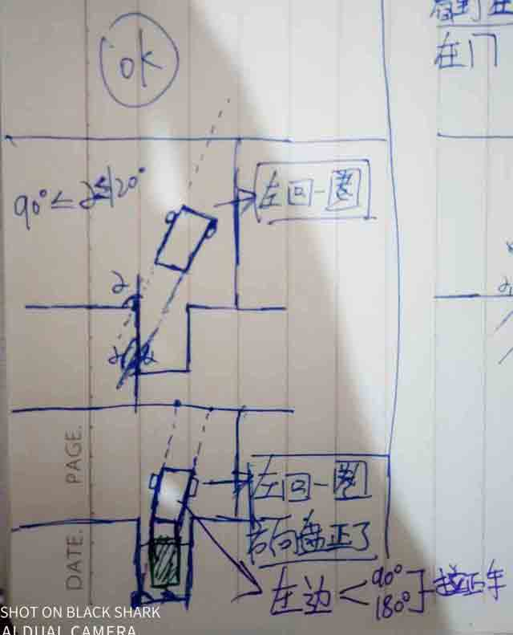

# day02_倒车入库

1：上车准备（安全带、座椅、手刹）

## 右边入库

2：到特定点（右边打满两圈，）
  2.1：特定点前（早了）

  2.2：特定点后（晚了）

3：（观察左边镜）直到…  看到左边裤脚1 刚好出现（方向盘左边回打一圈）。
 3.1：过了左边第一个裤脚怎么办。
       

4：（继续观察左边镜）直到… 看到左库角2刚好出现，（方向盘左边在回打一圈，也就是回正了！）
5：继续观察（左边镜：车尾贴边窄，右边打4分之1。车尾贴边宽，左边打4分之1。——推车回正效果），贴边回正！

6：停车看停车线点位，以左镜覆盖为准！

## 左边出库

7：前进档，后轮压停车线   时（第五个点位）（左打满2全，回90度）

## 左边入库

8：保持（左打满2全，回90度）倒车，直到…观察右镜（右边1裤脚刚好出现时！有打方向盘一圈，注意是回270度方向盘，还剩下360度，也就是一圈！）
9：直到…观察看到右边2裤脚时，向右打一圈方向盘回正。
10：注意观察车身拉直线平行！

## 右边出库

11：同理左边出库，方向相反！