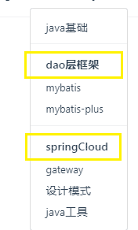
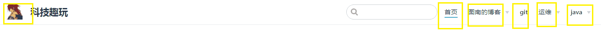
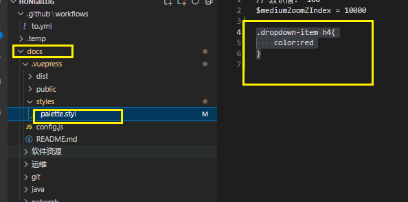
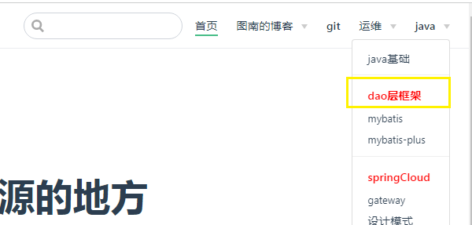

# 导航栏设置

效果图



## 配置logo




直接上代码。

```js
 // 主题配置
  themeConfig: {

    logo: 'logo.svg',
    // ====================顶上的导航栏
    nav: [

      // 选项一
      { text: '首页', link: '/' },

      // 选项二
      {
        text: '图南的博客',
        // 子选项
        items: [
          { text: 'Github', link: 'https://github.com/triggergun' },
          { text: '知乎', link: 'https://www.zhihu.com/people/hong-lang-80-78/posts' }
        ]
      },

      //选项三
      { text: 'git', link: '/git/git' },


      //选项4    link 
      {
        text: '运维',
        items: [
          { text: '命令', link: '/运维/windows/cmd' },
          { text: '网络', link: '/network/network01' }
        ]

      },


      // top  选项5
      {
        text: 'java',
        // 子选项
        items: [
          { text: 'java基础', link: '/java/javaSEBase/java' },
          //------------- dao层区
          {
            text: 'dao层框架',
            items: [
              { text: "mybatis", link: '/java/Mybatis/mybatis' },
              { text: "mybatis-plus", link: encodeURI('/java/Mybatis/mybatis_plus/03多数据库源的编写') },
            ]
          },

          //---------------springCloud
          {
            text: 'springCloud',
            items: [
              { text: "gateway", link: '/java/springcloudgateway/01gateway' },

            ]
          },
          { text: '设计模式', link: '/java/designModel/AssemblerDesignPattern' },
          { text: 'java工具', link: encodeURI('/java/java工具/xpath解析doc') }

        ]
      }
    ],

    // ===================================================侧边栏====================================
```

## 配置样式案例：

在palette.styl文件进行如下配置

```css
.dropdown-item h4{
    color:red
}
```

**步骤1**：创建;docs\.vuepress\styles\palette.styl



**步骤2**：运npm run dev看效果



**步骤3**：先看看[官网详解](https://v2.vuepress.vuejs.org/zh/reference/default-theme/styles.html)，也可在目录下找到官方变量

