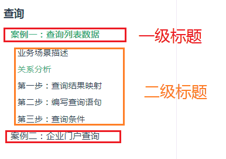
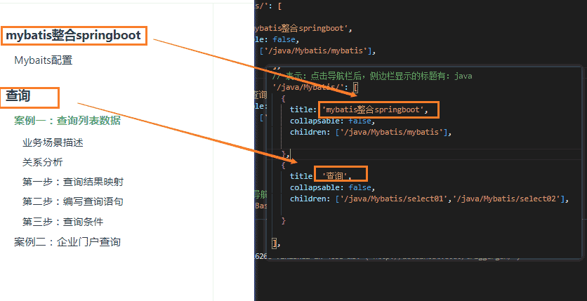
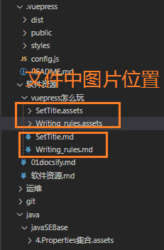

# vuepress标体设置规则

## 01）标题级别怎么搞！

我亲自实验了一下的结果。

- 一般是一级标题为一个
- 下面就是只能展示二级标体，三级标题不能显示。

## 02）怎么搞如下效果呢？



- 第一步：配置cofig.js文件


```js
      // 表示：点击导航栏后，侧边栏显示的标题有：java
      '/java/Mybatis/': [
        {
          title: 'mybatis整合springboot',
          collapsable: false,
          children: ['/java/Mybatis/mybatis'],

        },
        {
          title: '查询',
          collapsable: false,
          children: ['/java/Mybatis/select01','/java/Mybatis/select02'],

        }

      ],
```


效果就是：侧边栏显示的效果



## 03）编写代码

文件命名用英文。不要用中文，中文不太支持！




