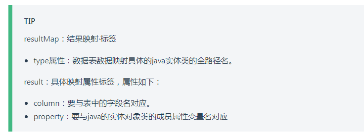

# vuepress常用语法

## 01）提示块



语法：

```markdown
:::tip

:::
```

怎么写：

```markdown
:::tip
resultMap：结果映射·标签

- type属性：数据表数据映射具体的java实体类的全路径名。

result：具体映射属性标签，属性如下：

- column：要与表中的字段名对应。
 - property：要与java的实体对象类的成员属性变量名对应
:::
```

