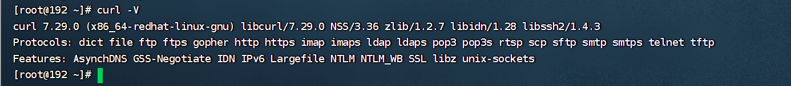

# yum源修改

## 问题描述


当前主机只有curl命令可以用：



wget的命令没有：

```
[root@192 ~]# wget
-bash: wget: 未找到命令
```

## 1)找到yum源的配置路径

在主机的  /etc/yum.repos.d/ 目录下：

```powershell
[root@192 ~]# cd /etc/yum.repos.d/
[root@192 yum.repos.d]# ll
总用量 32
-rw-r--r--. 1 root root 1664 9月   5 2019 CentOS-Base.repo
-rw-r--r--. 1 root root 1309 9月   5 2019 CentOS-CR.repo
-rw-r--r--. 1 root root  649 9月   5 2019 CentOS-Debuginfo.repo
-rw-r--r--. 1 root root  314 9月   5 2019 CentOS-fasttrack.repo
-rw-r--r--. 1 root root  630 9月   5 2019 CentOS-Media.repo
-rw-r--r--. 1 root root 1331 9月   5 2019 CentOS-Sources.repo
-rw-r--r--. 1 root root 6639 9月   5 2019 CentOS-Vault.repo
```

## 2)重命名原来的源配置文件

备份。下命令在centos7上无脑粘贴就行。

```powershell
mv /etc/yum.repos.d/CentOS-Base.repo /etc/yum.repos.d/CentOS-Base.repo.backup  
```

## 3)下载CentOS-7的repo文件

使用wget

```shell
wget -O /etc/yum.repos.d/CentOS-Base.repo http://mirrors.aliyun.com/repo/Centos-7.repo
```

使用curl

```shell
curl -o /etc/yum.repos.d/CentOS-Base.repo http://mirrors.aliyun.com/repo/Centos-7.repo
```

下载效果：

```
[root@192 yum.repos.d]# curl -o /etc/yum.repos.d/CentOS-Base.repo http://mirrors.aliyun.com/repo/Centos-7.repo
  % Total    % Received % Xferd  Average Speed   Time    Time     Time  Current
                                 Dload  Upload   Total   Spent    Left  Speed
100  2523  100  2523    0     0  23696      0 --:--:-- --:--:-- --:--:-- 23801
[root@192 yum.repos.d]# ll
总用量 36
-rw-r--r--. 1 root root 2523 2月  26 21:46 CentOS-Base.repo
-rw-r--r--. 1 root root 1664 9月   5 2019 CentOS-Base.repo.backup
-rw-r--r--. 1 root root 1309 9月   5 2019 CentOS-CR.repo
-rw-r--r--. 1 root root  649 9月   5 2019 CentOS-Debuginfo.repo
-rw-r--r--. 1 root root  314 9月   5 2019 CentOS-fasttrack.repo
-rw-r--r--. 1 root root  630 9月   5 2019 CentOS-Media.repo
-rw-r--r--. 1 root root 1331 9月   5 2019 CentOS-Sources.repo
-rw-r--r--. 1 root root 6639 9月   5 2019 CentOS-Vault.repo

```


## 4)更新镜像源

清除缓存：

```shell
yum clean all
```

生成缓存：

```shell
yum makecache
```

## 5)更新yum

```shell
yum update
```


