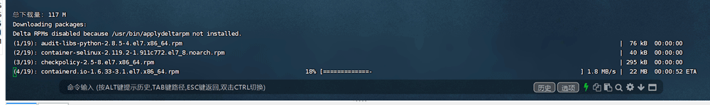

# centos7安装docker

这里面安装的是docker最新版。

启用 IPv4 数据包转发（`net.ipv4.ip_forward=1`），通常用于路由器或容器化环境。

增加进程的内存映射区域数量限制（`vm.max_map_count=655360`），通常用于运行 Elasticsearch 等需要大量内存映射的应用程序。

```shell
cat >> /etc/sysctl.conf <<-'EOF'
net.ipv4.ip_forward=1
vm.max_map_count=655360
EOF
```

这些配置不会立即生效，需要运行以下命令使配置生效：

```shell
sysctl -p
```

通过这种方式，可以方便地将内核参数配置写入 `/etc/sysctl.conf` 文件，并使其永久生效。

```shell
systemctl stop firewalld
```

## 1)安装底层工具

执行下面命令的前提是要保证yum源正常。

```
sudo yum install -y yum-utils device-mapper-persistent-data lvm2
```

 这是我们安装Docker的底层⼯具，它就会⾃动的给我们提示下载，很快下载就完成了。  

这条命令的作用是安装 `yum-utils`、`device-mapper-persistent-data` 和 `lvm2` 三个软件包，通常用于增强系统管理能力，尤其是在存储管理和 Docker 配置中。

问：yum-utils是什么？

- **作用**：这是一个包含多个实用工具的软件包，用于扩展 `yum` 的功能。
- **常用工具**：
  - `yum-config-manager`：管理 YUM 仓库配置。
  - `repoquery`：查询仓库中的软件包信息。
  - `yumdownloader`：下载 RPM 包而不安装。
- **用途**：在管理 YUM 仓库或调试包依赖时非常有用

问：device-mapper-persistent-data是什么？

- **作用**：这是一个用于管理设备映射（Device Mapper）的工具，提供持久化存储设备映射的功能。
- **用途**：通常用于 LVM（逻辑卷管理）和 Docker 的存储驱动（如 `devicemapper`）。

问：lvm2是什么？

- **作用**：LVM2（Logical Volume Manager 2）是一个逻辑卷管理工具，用于管理磁盘分区和卷。
- **功能**：
  - 创建、调整大小、删除逻辑卷。
  - 动态调整磁盘空间。
  - 支持快照和卷组管理。
- **用途**：在需要灵活管理磁盘空间时非常有用，尤其是在服务器环境中。

## 2)加入阿里云yum仓库提速docker下载过程  

2.1)增加阿⾥云的Docker下载仓库，默认情况下，Docker官⽅是从他的国外的服务器下载速度是⾮常慢的， 所以在这⾥我们是使用yum  -config-manager组件来指定⼀个新的下载源，指向的是阿里的应用服务器， 通过阿⾥来提高我们Docker的下载速度。

```
sudo yum-config-manager --add-repo http://mirrors.aliyun.com/docker-ce/linux/centos/docker-ce.repo
```

2.2) 更新⼀下仓库的源信息 。

```
sudo yum makecache fast
```

执行效果

```
[root@192 yum.repos.d]# sudo yum makecache fast
已加载插件：fastestmirror
Loading mirror speeds from cached hostfile
 * base: mirrors.aliyun.com
 * extras: mirrors.aliyun.com
 * updates: mirrors.aliyun.com
base                                                                                                                                                                        | 3.6 kB  00:00:00     
docker-ce-stable                                                                                                                                                            | 3.5 kB  00:00:00     
extras                                                                                                                                                                      | 2.9 kB  00:00:00     
updates                                                                                                                                                                     | 2.9 kB  00:00:00     
(1/2): docker-ce-stable/7/x86_64/updateinfo                                                                                                                                 |   55 B  00:00:00     
(2/2): docker-ce-stable/7/x86_64/primary_db                                                                                                                                 | 152 kB  00:00:00     
元数据缓存已建立
[root@192 yum.repos.d]# 

```

## 3) 自动安装下载Docker

```
 sudo yum -y install docker-ce
```

执行上面命令后大概要1分钟时间下载。效果如下图：



安装docker的依赖信息：

```
已安装:
docker-ce.x86_64 3:26.1.4-1.el7                                                                           
作为依赖被安装:
audit-libs-python.x86_64 0:2.8.5-4.el7       
checkpolicy.x86_64 0:2.5-8.el7               
container-selinux.noarch 2:2.119.2-1.911c772.el7_8    
containerd.io.x86_64 0:1.6.33-3.1.el7         
docker-buildx-plugin.x86_64 0:0.14.1-1.el7    
docker-ce-cli.x86_64 1:26.1.4-1.el7           
docker-ce-rootless-extras.x86_64 0:26.1.4-1.el7       
docker-compose-plugin.x86_64 0:2.27.1-1.el7   
fuse-overlayfs.x86_64 0:0.7.2-6.el7_8         
fuse3-libs.x86_64 0:3.6.1-4.el7               
libcgroup.x86_64 0:0.41-21.el7                        
libseccomp.x86_64 0:2.3.1-4.el7               
libsemanage-python.x86_64 0:2.5-14.el7        
policycoreutils-python.x86_64 0:2.5-34.el7    
python-IPy.noarch 0:0.75-6.el7                        
setools-libs.x86_64 0:3.3.8-4.el7             
slirp4netns.x86_64 0:0.4.3-4.el7_8           
作为依赖被升级:
policycoreutils.x86_64 0:2.5-34.el7  
```

## 4)启动docker服务

```
sudo service docker start
```


## 5)验证docker是否启动成功 

```
docker version
```

验证结果： 26.1.4

```
[root@192 yum.repos.d]# docker version
Client: Docker Engine - Community
 Version:           26.1.4
 API version:       1.45
 Go version:        go1.21.11
 Git commit:        5650f9b
 Built:             Wed Jun  5 11:32:04 2024
 OS/Arch:           linux/amd64
 Context:           default

Server: Docker Engine - Community
 Engine:
  Version:          26.1.4
  API version:      1.45 (minimum version 1.24)
  Go version:       go1.21.11
  Git commit:       de5c9cf
  Built:            Wed Jun  5 11:31:02 2024
  OS/Arch:          linux/amd64
  Experimental:     false
 containerd:
  Version:          1.6.33
  GitCommit:        d2d58213f83a351ca8f528a95fbd145f5654e957
 runc:
  Version:          1.1.12
  GitCommit:        v1.1.12-0-g51d5e94
 docker-init:
  Version:          0.19.0
  GitCommit:        de40ad0
[root@192 yum.repos.d]# 
```


