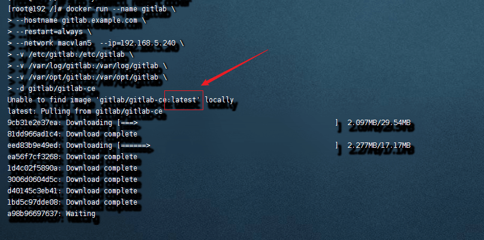
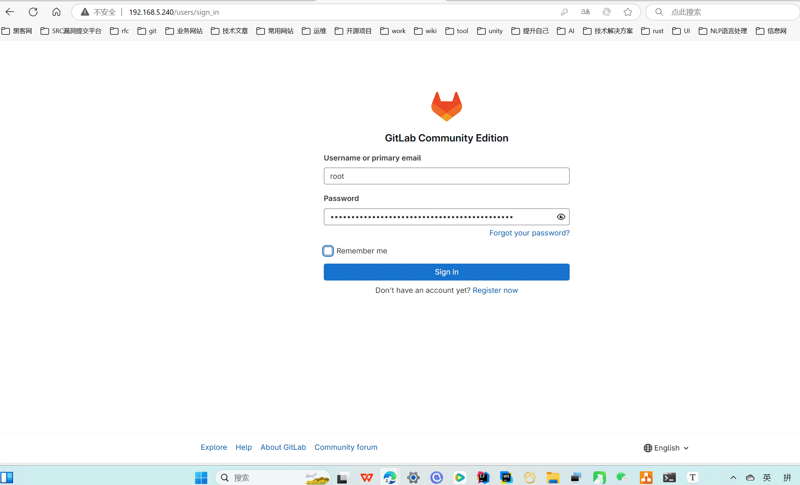
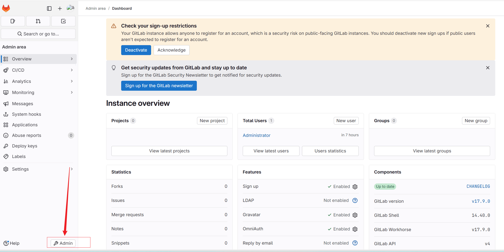
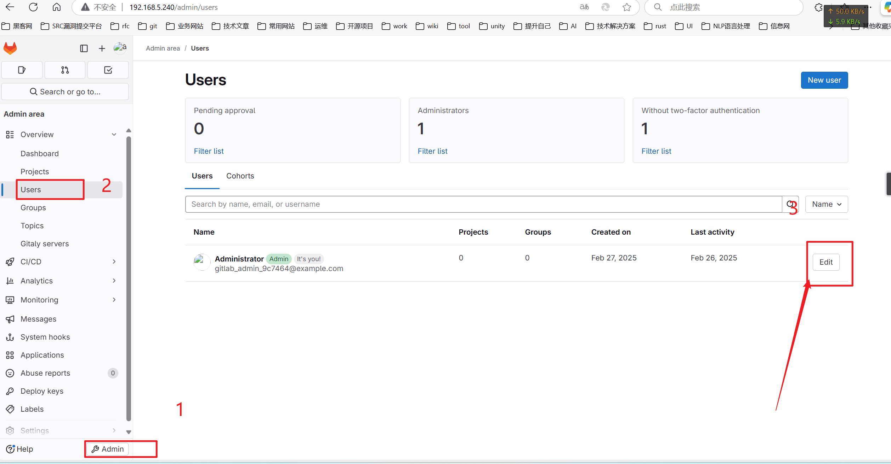

# 安装并初始化Gitlab


## 开启Macvlan

```shell
docker network create -d macvlan \
  --subnet=192.168.5.0/24 \
  --ip-range=192.168.5.0/24 \
  --gateway=192.168.5.1 \
  -o parent=ens33 \
  macvlan5
```

192.168.5.0是网络号。（也叫网段）


## 下载GitLab容器

| 容器的名字 | ip地址分配    |
| ---------- | ------------- |
| GitLab     | 192.168.5.240 |

删除在主机上有关gitlab的目录。（起到初始化作用。）

```shell
rm -rf /etc/gitlab
rm -rf /var/log/gitlab
rm -rf /var/opt/gitlab
```

删除gitlab的容器

```shell
docker rm -f gitlab
```

创建gitlab的目录

```shell
mkdir -p /etc/gitlab
mkdir -p /var/log/gitlab
mkdir -p /var/opt/gitlab
```

给目录分配权限。

```shell
chmod -R 755 /etc/gitlab
chmod -R 755 /var/log/gitlab
chmod -R 755 /var/opt/gitlab
```


docker创建容器的命令：

```shell
docker run --name gitlab \
--hostname gitlab.example.com \
--restart=always \
--network macvlan5  --ip=192.168.5.240 \
-v /etc/gitlab:/etc/gitlab \
-v /var/log/gitlab:/var/log/gitlab \
-v /var/opt/gitlab:/var/opt/gitlab \
-d gitlab/gitlab-ce
```

配置好下载进行的镜像源后的执行效果：



查看日志命令

```shell
docker logs -f gitlab
```


## 修改gitlab初始化密码

获取初始化密码

```
sudo docker exec -it gitlab grep 'Password:' /etc/gitlab/initial_root_password
```

执行上面命令效果如下：

```
[root@192 /]# sudo docker exec -it gitlab grep 'Password:' /etc/gitlab/initial_root_password
Password: NwE3H6qsRq3nKFK8iNG0GmoTfWrPM4q1K/LijQ75w28=
[root@192 /]# 
```

用户默认是：root

密码：NwE3H6qsRq3nKFK8iNG0GmoTfWrPM4q1K/LijQ75w28=

192.168.5.240








