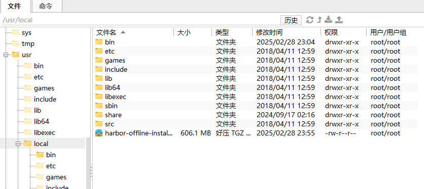
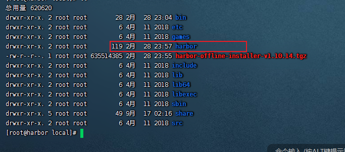
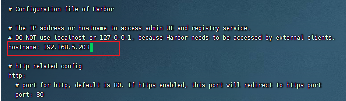
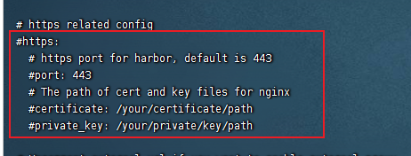
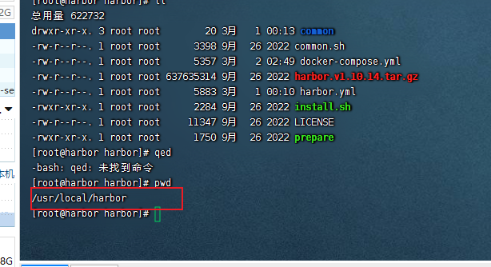
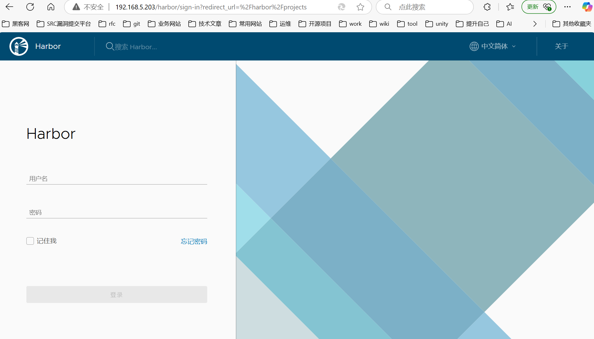
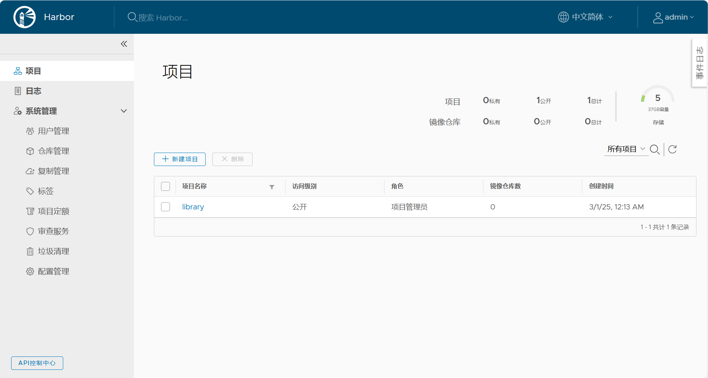

# 安装harbor

## 初始化系统

```
cat > /etc/sysctl.conf <<-'EOF'
net.ipv4.ip_forward=1
vm.max_map_count=655360
EOF
```

配置文件生效。

```
sysctl -p
```

关闭防火墙。

```
systemctl stop firewalld
```

## 安装docker&dockerCompose

安装docker

[centos7安装docker | 匆匆趣玩](https://wutunan.top/运维/centos/demo02_2025_02_27.html#_1-安装底层工具)

[02)centOS安装docker | 匆匆趣玩](https://wutunan.top/运维/windows/docker/02contos安装docker.html)

---

安装docker-compose：

[03)centos安装dockerCompose | 匆匆趣玩](https://wutunan.top/运维/windows/docker/03centos安装docker_compose.html)


## 下载离线harbor安装包

进入到harbor安装的目录。

```
cd /usr/local
```


```
wget --no-check-certificate https://github.com/goharbor/harbor/releases/download/v1.10.14/harbor-offline-installer-v1.10.14.tgz
```

文件有点大。我们使用windows的魔法上网将其下载下来。




```
 tar xzvf harbor-offline-installer-v1.10.14.tgz
```




解压后，我们要去修改配置文件。


## 修改harbor的配置文件

```
cd harbor
```


```
# Configuration file of Harbor

# The IP address or hostname to access admin UI and registry service.
# DO NOT use localhost or 127.0.0.1, because Harbor needs to be accessed by external clients.
hostname: reg.mydomain.com

# http related config
http:
  # port for http, default is 80. If https enabled, this port will redirect to https port
  port: 80

# https related config
https:
  # https port for harbor, default is 443
  port: 443
  # The path of cert and key files for nginx
  certificate: /your/certificate/path
  private_key: /your/private/key/path

# Uncomment external_url if you want to enable external proxy
# And when it enabled the hostname will no longer used
# external_url: https://reg.mydomain.com:8433

# The initial password of Harbor admin
# It only works in first time to install harbor
# Remember Change the admin password from UI after launching Harbor.
harbor_admin_password: Harbor12345

# Harbor DB configuration
database:
  # The password for the root user of Harbor DB. Change this before any production use.
  password: root123
  # The maximum number of connections in the idle connection pool. If it <=0, no idle connections are retained.
  max_idle_conns: 50
  # The maximum number of open connections to the database. If it <= 0, then there is no limit on the number of open connections.
  # Note: the default number of connections is 100 for postgres.
  max_open_conns: 100

# The default data volume
data_volume: /data

# Harbor Storage settings by default is using /data dir on local filesystem
# Uncomment storage_service setting If you want to using external storage
# storage_service:
#   # ca_bundle is the path to the custom root ca certificate, which will be injected into the truststore
#   # of registry's and chart repository's containers.  This is usually needed when the user hosts a internal storage with self signed certificate.
#   ca_bundle:

#   # storage backend, default is filesystem, options include filesystem, azure, gcs, s3, swift and oss
#   # for more info about this configuration please refer https://docs.docker.com/registry/configuration/
#   filesystem:
#     maxthreads: 100
#   # set disable to true when you want to disable registry redirect
#   redirect:
#     disabled: false

# Clair configuration
clair:
  # The interval of clair updaters, the unit is hour, set to 0 to disable the updaters.
  updaters_interval: 12

jobservice:
  # Maximum number of job workers in job service
  max_job_workers: 10

notification:
  # Maximum retry count for webhook job
  webhook_job_max_retry: 10

chart:
  # Change the value of absolute_url to enabled can enable absolute url in chart
  absolute_url: disabled

# Log configurations
log:
  # options are debug, info, warning, error, fatal
  level: info
  # configs for logs in local storage
  local:
    # Log files are rotated log_rotate_count times before being removed. If count is 0, old versions are removed rather than rotated.
    rotate_count: 50
    # Log files are rotated only if they grow bigger than log_rotate_size bytes. If size is followed by k, the size is assumed to be in kilobytes.
    # If the M is used, the size is in megabytes, and if G is used, the size is in gigabytes. So size 100, size 100k, size 100M and size 100G
    # are all valid.
    rotate_size: 200M
    # The directory on your host that store log
    location: /var/log/harbor

  # Uncomment following lines to enable external syslog endpoint.
  # external_endpoint:
  #   # protocol used to transmit log to external endpoint, options is tcp or udp
  #   protocol: tcp
  #   # The host of external endpoint
  #   host: localhost
  #   # Port of external endpoint
  #   port: 5140

#This attribute is for migrator to detect the version of the .cfg file, DO NOT MODIFY!
_version: 1.10.0

# Uncomment external_database if using external database.
# external_database:
#   harbor:
#     host: harbor_db_host
#     port: harbor_db_port
#     db_name: harbor_db_name
#     username: harbor_db_username
#     password: harbor_db_password
#     ssl_mode: disable
#     max_idle_conns: 2
#     max_open_conns: 0
#   clair:
#     host: clair_db_host
#     port: clair_db_port
#     db_name: clair_db_name
#     username: clair_db_username
#     password: clair_db_password
#     ssl_mode: disable
#   notary_signer:
#     host: notary_signer_db_host
#     port: notary_signer_db_port
#     db_name: notary_signer_db_name
#     username: notary_signer_db_username
#     password: notary_signer_db_password
#     ssl_mode: disable
#   notary_server:
#     host: notary_server_db_host
#     port: notary_server_db_port
#     db_name: notary_server_db_name
#     username: notary_server_db_username
#     password: notary_server_db_password
#     ssl_mode: disable

# Uncomment external_redis if using external Redis server
# external_redis:
#   host: redis
#   port: 6379
#   password:
#   # db_index 0 is for core, it's unchangeable
#   registry_db_index: 1
#   jobservice_db_index: 2
#   chartmuseum_db_index: 3
#   clair_db_index: 4

# Uncomment uaa for trusting the certificate of uaa instance that is hosted via self-signed cert.
# uaa:
#   ca_file: /path/to/ca

# Global proxy
# Config http proxy for components, e.g. http://my.proxy.com:3128
# Components doesn't need to connect to each others via http proxy.
# Remove component from `components` array if want disable proxy
# for it. If you want use proxy for replication, MUST enable proxy
# for core and jobservice, and set `http_proxy` and `https_proxy`.
# Add domain to the `no_proxy` field, when you want disable proxy
# for some special registry.
proxy:
  http_proxy:
  https_proxy:
  # no_proxy endpoints will appended to 127.0.0.1,localhost,.local,.internal,log,db,redis,nginx,core,portal,postgresql,jobservice,registry,registryctl,clair,chartmuseum,notary-server
  no_proxy:
  components:
    - core
    - jobservice
    - clair

```








## 启动harbor

```
./install.sh 
```

启动的日志

```
[root@harbor harbor]# ./install.sh 

[Step 0]: checking if docker is installed ...

Note: docker version: 26.1.4

[Step 1]: checking docker-compose is installed ...

Note: docker-compose version: 2.6.1

[Step 2]: loading Harbor images ...
e200d3f97e2e: Loading layer [==================================================>]  34.66MB/34.66MB
44eb15348b09: Loading layer [==================================================>]  9.549MB/9.549MB
826c5cc00332: Loading layer [==================================================>]  3.584kB/3.584kB
de76082ef3d4: Loading layer [==================================================>]  3.072kB/3.072kB
2c413d9fd3dd: Loading layer [==================================================>]  17.32MB/17.32MB
31edb1789798: Loading layer [==================================================>]  18.14MB/18.14MB
Loaded image: goharbor/registry-photon:v1.10.14
f8344c689281: Loading layer [==================================================>]  9.544MB/9.544MB
d36daed8f1ac: Loading layer [==================================================>]  5.683MB/5.683MB
1cdcddcaf4e9: Loading layer [==================================================>]  13.33MB/13.33MB
78ed3f0ddf0c: Loading layer [==================================================>]  26.35MB/26.35MB
a0cee296b3c5: Loading layer [==================================================>]  22.02kB/22.02kB
8e332dd60b37: Loading layer [==================================================>]  13.33MB/13.33MB
Loaded image: goharbor/notary-signer-photon:v1.10.14
a46c6514d011: Loading layer [==================================================>]  9.549MB/9.549MB
8c4d0916c122: Loading layer [==================================================>]  59.94MB/59.94MB
5bdb65cef867: Loading layer [==================================================>]  3.072kB/3.072kB
fdf14abc5da6: Loading layer [==================================================>]  3.584kB/3.584kB
b29cdf20152a: Loading layer [==================================================>]  60.77MB/60.77MB
Loaded image: goharbor/chartmuseum-photon:v1.10.14
a57727bb8cad: Loading layer [==================================================>]  13.31MB/13.31MB
2c8b8f237c46: Loading layer [==================================================>]  33.88MB/33.88MB
4dbd90795b69: Loading layer [==================================================>]  5.632kB/5.632kB
14ffb588e5ea: Loading layer [==================================================>]  40.45kB/40.45kB
0f168c0d8fba: Loading layer [==================================================>]   2.56kB/2.56kB
Loaded image: goharbor/harbor-core:v1.10.14
0cd68db36052: Loading layer [==================================================>]  9.549MB/9.549MB
6b5b40a98bdf: Loading layer [==================================================>]  3.584kB/3.584kB
d11edd3c3338: Loading layer [==================================================>]  17.32MB/17.32MB
eb8fdd9a975b: Loading layer [==================================================>]  3.072kB/3.072kB
a4022d8b9738: Loading layer [==================================================>]   7.41MB/7.41MB
bf92edc378a9: Loading layer [==================================================>]  25.55MB/25.55MB
Loaded image: goharbor/harbor-registryctl:v1.10.14
43e0f6c30ee0: Loading layer [==================================================>]  124.4MB/124.4MB
741c1219cada: Loading layer [==================================================>]  3.072kB/3.072kB
0be9093e8b11: Loading layer [==================================================>]   59.9kB/59.9kB
ecffd8a35c17: Loading layer [==================================================>]  61.95kB/61.95kB
Loaded image: goharbor/redis-photon:v1.10.14
bc76e9ae8711: Loading layer [==================================================>]  5.683MB/5.683MB
86c93ad94fd0: Loading layer [==================================================>]  14.86MB/14.86MB
ea5f73952c7a: Loading layer [==================================================>]  26.35MB/26.35MB
b5ffc33e694d: Loading layer [==================================================>]  22.02kB/22.02kB
1645f60d076b: Loading layer [==================================================>]  14.86MB/14.86MB
Loaded image: goharbor/notary-server-photon:v1.10.14
8f60de414560: Loading layer [==================================================>]    129MB/129MB
dbec5baa87ad: Loading layer [==================================================>]  53.28MB/53.28MB
d0843e526392: Loading layer [==================================================>]   2.56kB/2.56kB
3da62befb62d: Loading layer [==================================================>]  1.536kB/1.536kB
2f3db3f6744b: Loading layer [==================================================>]  155.6kB/155.6kB
5701b3b2e0fc: Loading layer [==================================================>]   1.78MB/1.78MB
Loaded image: goharbor/prepare:v1.10.14
8c817c2d8447: Loading layer [==================================================>]  65.09MB/65.09MB
7ee6b0aa6d04: Loading layer [==================================================>]  100.3MB/100.3MB
96f6971258b6: Loading layer [==================================================>]  5.632kB/5.632kB
4f98806e7849: Loading layer [==================================================>]   2.56kB/2.56kB
3c78ceb2dee2: Loading layer [==================================================>]   2.56kB/2.56kB
e75025179c29: Loading layer [==================================================>]   2.56kB/2.56kB
9e8414ebd453: Loading layer [==================================================>]   2.56kB/2.56kB
c91925c6ba99: Loading layer [==================================================>]  10.75kB/10.75kB
Loaded image: goharbor/harbor-db:v1.10.14
3a7a393741ad: Loading layer [==================================================>]   11.4MB/11.4MB
Loaded image: goharbor/nginx-photon:v1.10.14
abd402223c05: Loading layer [==================================================>]  123.1MB/123.1MB
ae0cd89fa4ee: Loading layer [==================================================>]  11.97MB/11.97MB
e3ab64ba2ed0: Loading layer [==================================================>]  3.072kB/3.072kB
9fb89f582b34: Loading layer [==================================================>]  49.15kB/49.15kB
31f15c926966: Loading layer [==================================================>]  3.584kB/3.584kB
8a881bb13354: Loading layer [==================================================>]  12.84MB/12.84MB
Loaded image: goharbor/clair-photon:v1.10.14
10ac0893e786: Loading layer [==================================================>]   11.4MB/11.4MB
672079c830ad: Loading layer [==================================================>]  7.697MB/7.697MB
e929442ae505: Loading layer [==================================================>]  223.2kB/223.2kB
ab2342b334c6: Loading layer [==================================================>]  195.1kB/195.1kB
4f55de5f5406: Loading layer [==================================================>]  15.36kB/15.36kB
1ae5ea4ecb99: Loading layer [==================================================>]  3.584kB/3.584kB
Loaded image: goharbor/harbor-portal:v1.10.14
904d0e940b56: Loading layer [==================================================>]  75.92MB/75.92MB
5e4332f602d3: Loading layer [==================================================>]  3.584kB/3.584kB
a00b94541398: Loading layer [==================================================>]  3.072kB/3.072kB
6d2c1c6e6a52: Loading layer [==================================================>]   2.56kB/2.56kB
fee37f45b9ac: Loading layer [==================================================>]  3.072kB/3.072kB
941af6804d0a: Loading layer [==================================================>]  3.584kB/3.584kB
e15b3a740d7b: Loading layer [==================================================>]  12.29kB/12.29kB
3b2e09c6ee4a: Loading layer [==================================================>]  3.584kB/3.584kB
Loaded image: goharbor/harbor-log:v1.10.14
c1d31d783dfd: Loading layer [==================================================>]  13.31MB/13.31MB
3c4e77d73ea3: Loading layer [==================================================>]  39.06MB/39.06MB
Loaded image: goharbor/harbor-jobservice:v1.10.14
6cbad90fe384: Loading layer [==================================================>]  9.549MB/9.549MB
0cdb9761b80c: Loading layer [==================================================>]  11.49MB/11.49MB
1aedd63de9ff: Loading layer [==================================================>]  11.49MB/11.49MB
Loaded image: goharbor/clair-adapter-photon:v1.10.14


[Step 3]: preparing environment ...

[Step 4]: preparing harbor configs ...
prepare base dir is set to /usr/local/harbor
/usr/src/app/utils/configs.py:100: YAMLLoadWarning: calling yaml.load() without Loader=... is deprecated, as the default Loader is unsafe. Please read https://msg.pyyaml.org/load for full details.
  configs = yaml.load(f)
WARNING:root:WARNING: HTTP protocol is insecure. Harbor will deprecate http protocol in the future. Please make sure to upgrade to https
/usr/src/app/utils/configs.py:90: YAMLLoadWarning: calling yaml.load() without Loader=... is deprecated, as the default Loader is unsafe. Please read https://msg.pyyaml.org/load for full details.
  versions = yaml.load(f)
Generated configuration file: /config/log/logrotate.conf
Generated configuration file: /config/log/rsyslog_docker.conf
Generated configuration file: /config/nginx/nginx.conf
Generated configuration file: /config/core/env
Generated configuration file: /config/core/app.conf
Generated configuration file: /config/registry/config.yml
Generated configuration file: /config/registryctl/env
Generated configuration file: /config/db/env
Generated configuration file: /config/jobservice/env
Generated configuration file: /config/jobservice/config.yml
Generated and saved secret to file: /secret/keys/secretkey
Generated certificate, key file: /secret/core/private_key.pem, cert file: /secret/registry/root.crt
Generated configuration file: /compose_location/docker-compose.yml
Clean up the input dir


[Step 5]: starting Harbor ...
[+] Running 10/10
 ⠿ Network harbor_harbor        Created                                                                                                                                                       0.1s
 ⠿ Container harbor-log         Started                                                                                                                                                       0.4s
 ⠿ Container harbor-db          Started                                                                                                                                                       0.8s
 ⠿ Container harbor-portal      Started                                                                                                                                                       0.9s
 ⠿ Container registry           Started                                                                                                                                                       0.8s
 ⠿ Container redis              Started                                                                                                                                                       0.9s
 ⠿ Container registryctl        Started                                                                                                                                                       0.9s
 ⠿ Container harbor-core        Started                                                                                                                                                       1.1s
 ⠿ Container harbor-jobservice  Started                                                                                                                                                       1.4s
 ⠿ Container nginx              Started                                                                                                                                                       1.5s
✔ ----Harbor has been installed and started successfully.----
[root@harbor harbor]# 

```


## 关闭barbor容器

```
docker compose down
```


在哪里重新启动容器与关闭容器。答：目前安装在：/usr/local的目录下。




## 验证是否安装成功





默认的密码是。

admin

Harbor12345




