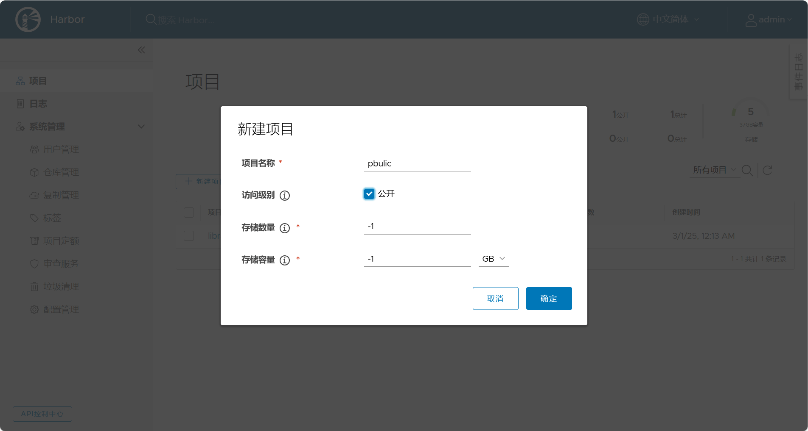
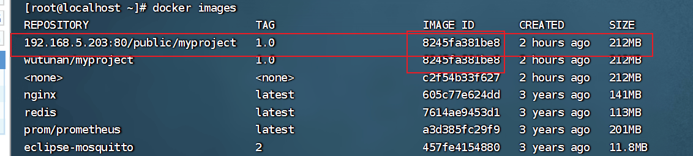
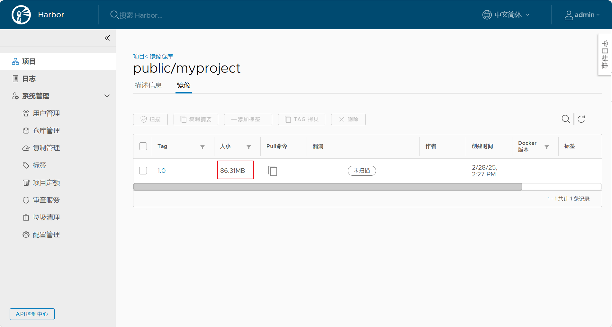
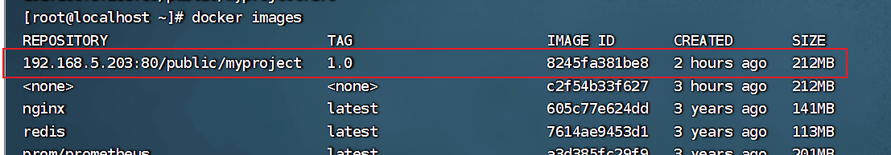

# 向Harbor上传自定义镜像


## 新建项目



公开的特点：上传镜像是要用户名与密码的。用户去拉取是不需要用户密码的。


## 上传镜像到仓库

查看下/etc/docker/daemon.json文件

```
vi /etc/docker/daemon.json
```

在目标服务器上配置如下：

```
cat > /etc/docker/daemon.json <<-'EOF'
{
    "registry-mirrors": [
        "https://<changme>.mirror.aliyuncs.com",
        "https://dockerproxy.com",
        "https://mirror.baidubce.com",
        "https://docker.m.daocloud.io",
        "https://docker.nju.edu.cn",
        "https://docker.mirrors.sjtug.sjtu.edu.cn"
     ],
    "insecure-registries": ["192.168.5.203:80"]
}
EOF
```

192.168.5.203是harbor的地址

```
systemctl daemon-reload
```


```
systemctl restart docker
```


## 镜像名字书写规范

```
docker tag 8245fa381be8 192.168.5.203:80/public/myproject:1.0
```

docker tag 96e09ccfbe21 192.168.31.232:80/项目的名字/myproject:1.0(镜像名字)



在目标服务器上上传构建的镜像

```
docker login -u admin -p Harbor12345 192.168.5.203:80
```

- -u: 后面接用户名
- -p: 后面接密码
- 192.168.5.203:80 表示 harbor地址

```
[root@localhost ~]# docker login -u admin -p Harbor12345 192.168.5.203:80
WARNING! Using --password via the CLI is insecure. Use --password-stdin.
WARNING! Your password will be stored unencrypted in /root/.docker/config.json.
Configure a credential helper to remove this warning. See
https://docs.docker.com/engine/reference/commandline/login/#credentials-store

Login Succeeded
```

::: tip 密码怎么修改?

答:可以去harbor的后台界面去修改这个用户名字对应的密码

:::


推送镜像到仓库

```
docker push 192.168.5.203:80/public/myproject:1.0
```

执行推送的结果:

```
[root@localhost ~]# docker push 192.168.5.203:80/public/myproject:1.0
The push refers to repository [192.168.5.203:80/public/myproject]
5e2d267ba363: Pushed 
5f70bf18a086: Pushed 
b66078cf4b41: Pushed 
cd5a0a9f1e01: Pushed 
eafe6e032dbd: Pushed 
92a4e8a3140f: Pushed 
1.0: digest: sha256:d01646c2b7bedbaa8b5ec8bfd1b82414ff9f72b1e769fe46db9a412455b58a6d size: 1577
[root@localhost ~]# 

```


## 验证是否推送成功




## 拉取镜像实验

拉取镜像命令:

```
docker pull 192.168.5.203:80/public/myproject:1.0
```

拉取日志:

```
[root@localhost ~]# docker pull 192.168.5.203:80/public/myproject:1.0
1.0: Pulling from public/myproject
1efc276f4ff9: Already exists 
a2f2f93da482: Already exists 
1a2de4cc9431: Already exists 
d2421c7a4bbf: Already exists 
4f4fb700ef54: Already exists 
03a90c0a7153: Already exists 
Digest: sha256:d01646c2b7bedbaa8b5ec8bfd1b82414ff9f72b1e769fe46db9a412455b58a6d
Status: Downloaded newer image for 192.168.5.203:80/public/myproject:1.0
192.168.5.203:80/public/myproject:1.0

```

拉取结果:




