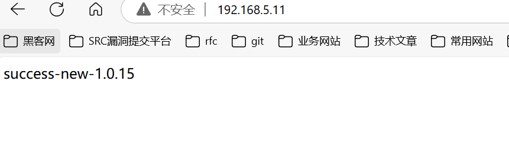
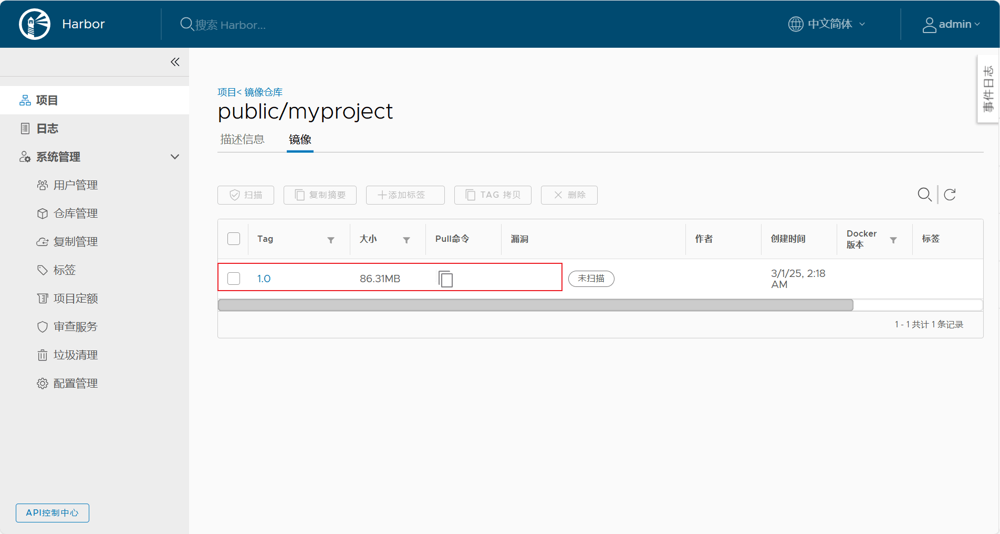

# harbor服务器进行构建镜像


## 配置镜像仓库地址

```shell
cat > /etc/docker/daemon.json <<-'EOF'
{
    "registry-mirrors": [
        "https://<changme>.mirror.aliyuncs.com",
        "https://dockerproxy.com",
        "https://mirror.baidubce.com",
        "https://docker.m.daocloud.io",
        "https://docker.nju.edu.cn",
        "https://docker.mirrors.sjtug.sjtu.edu.cn"
     ],
    "insecure-registries": ["192.168.5.203:80"]
}
EOF
```


```shell
systemctl daemon-reload
```


```shell
systemctl restart docker
```

## 验证是否能登入Harbor

```shell
docker login -u admin -p Harbor12345 192.168.5.203:80
```

验证成功的日志：

```shell
✔ ----Harbor has been installed and started successfully.----
[root@harbor harbor]# docker login -u admin -p Harbor12345 192.168.5.203:80
WARNING! Using --password via the CLI is insecure. Use --password-stdin.
WARNING! Your password will be stored unencrypted in /root/.docker/config.json.
Configure a credential helper to remove this warning. See
https://docs.docker.com/engine/reference/commandline/login/#credentials-store

Login Succeeded
[root@harbor harbor]# 

```


## jenkins新增服务器实例

现在harbor什么都没有。


第一步：选择系统管理。


第二步：找到系统配置。


我们新添加了一台harbor服务。所以要添加一个远程服务实例。


## jenkins重新配置任务


源码拉取没有变化，不用改变。


构建jar包也不需要调整的。


```shell
docker build -t 192.168.5.203:80/public/myproject:1.0 /usr/local/
docker login -u admin -p Harbor12345 192.168.5.203:80
docker push 192.168.5.203:80/public/myproject:1.0
```


::: warning ssh配置注意

如果远程执行命令时没有使用Exec in pty。ssh就会连接不上的问题。


:::


## jenkins执行远程拉取镜像

```shell
docker rm -f myproject
docker run -d -p 80:80 --name=myproject 192.168.5.203:80/public/myproject:1.0
```


## 验证结果

jenkins日志：

```
Started by user root
Running as SYSTEM
Building in workspace /var/jenkins_home/workspace/myproject-wutunan-ci
The recommended git tool is: NONE
No credentials specified
 > git rev-parse --resolve-git-dir /var/jenkins_home/workspace/myproject-wutunan-ci/.git # timeout=10
Fetching changes from the remote Git repository
 > git config remote.origin.url http://192.168.5.240/root/myproject_wutunan_ci # timeout=10
Fetching upstream changes from http://192.168.5.240/root/myproject_wutunan_ci
 > git --version # timeout=10
 > git --version # 'git version 2.39.5'
 > git fetch --tags --force --progress -- http://192.168.5.240/root/myproject_wutunan_ci +refs/heads/*:refs/remotes/origin/* # timeout=10
 > git rev-parse refs/remotes/origin/master^{commit} # timeout=10
Checking out Revision 821df6a6b3f6f394bbade7228fb1cff8fa4a36fd (refs/remotes/origin/master)
 > git config core.sparsecheckout # timeout=10
 > git checkout -f 821df6a6b3f6f394bbade7228fb1cff8fa4a36fd # timeout=10
Commit message: "Dockerfile文件的编写"
 > git rev-list --no-walk 821df6a6b3f6f394bbade7228fb1cff8fa4a36fd # timeout=10
[myproject-wutunan-ci] $ /bin/sh -xe /tmp/jenkins14065096122831739325.sh
+ sh /usr/local/maven/bin/mvn package
[INFO] Scanning for projects...
[INFO] 
[INFO] ------------------< top.wutunan:myproject_wutunan_ci >------------------
[INFO] Building myproject_wutunan_ci 1.0-SNAPSHOT
[INFO] --------------------------------[ jar ]---------------------------------
[INFO] 
[INFO] --- maven-resources-plugin:3.2.0:resources (default-resources) @ myproject_wutunan_ci ---
[INFO] Using 'UTF-8' encoding to copy filtered resources.
[INFO] Using 'UTF-8' encoding to copy filtered properties files.
[INFO] Copying 1 resource
[INFO] Copying 0 resource
[INFO] 
[INFO] --- maven-compiler-plugin:3.10.1:compile (default-compile) @ myproject_wutunan_ci ---
[INFO] Nothing to compile - all classes are up to date
[INFO] 
[INFO] --- maven-resources-plugin:3.2.0:testResources (default-testResources) @ myproject_wutunan_ci ---
[INFO] Using 'UTF-8' encoding to copy filtered resources.
[INFO] Using 'UTF-8' encoding to copy filtered properties files.
[INFO] skip non existing resourceDirectory /var/jenkins_home/workspace/myproject-wutunan-ci/src/test/resources
[INFO] 
[INFO] --- maven-compiler-plugin:3.10.1:testCompile (default-testCompile) @ myproject_wutunan_ci ---
[INFO] No sources to compile
[INFO] 
[INFO] --- maven-surefire-plugin:2.22.2:test (default-test) @ myproject_wutunan_ci ---
[INFO] No tests to run.
[INFO] 
[INFO] --- maven-jar-plugin:3.2.2:jar (default-jar) @ myproject_wutunan_ci ---
[INFO] Building jar: /var/jenkins_home/workspace/myproject-wutunan-ci/target/myproject.jar
[INFO] 
[INFO] --- spring-boot-maven-plugin:2.7.4:repackage (repackage) @ myproject_wutunan_ci ---
[INFO] Replacing main artifact with repackaged archive
[INFO] ------------------------------------------------------------------------
[INFO] BUILD SUCCESS
[INFO] ------------------------------------------------------------------------
[INFO] Total time:  2.009 s
[INFO] Finished at: 2025-02-28T18:11:27Z
[INFO] ------------------------------------------------------------------------
SSH: Connecting from host [6f4daa421264]
SSH: Connecting with configuration [192.168.5.203] ...
SSH: EXEC: completed after 412,105 ms
SSH: Disconnecting configuration [192.168.5.203] ...
SSH: Transferred 2 ( 1 + 1 ) file(s)
SSH: Connecting from host [6f4daa421264]
SSH: Connecting with configuration [192.168.5.11] ...
SSH: EXEC: completed after 1,803 ms
SSH: Disconnecting configuration [192.168.5.11] ...
SSH: Transferred 0 file(s)
Finished: SUCCESS
```

是否部署成功。



镜像是否上传成功。




