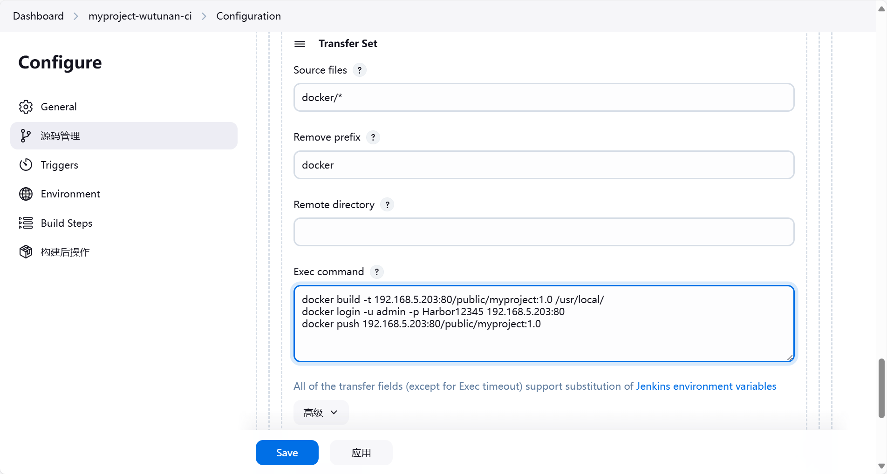

# harbor服务器进行构建镜像


## 配置镜像仓库地址

```shell
cat > /etc/docker/daemon.json <<-'EOF'
{
    "registry-mirrors": [
        "https://<changme>.mirror.aliyuncs.com",
        "https://dockerproxy.com",
        "https://mirror.baidubce.com",
        "https://docker.m.daocloud.io",
        "https://docker.nju.edu.cn",
        "https://docker.mirrors.sjtug.sjtu.edu.cn"
     ],
    "insecure-registries": ["192.168.5.203:80"]
}
EOF
```


```shell
systemctl daemon-reload
```


```shell
systemctl restart docker
```

## 验证是否能登入Harbor

```shell
docker login -u admin -p Harbor12345 192.168.5.203:80
```

验证成功的日志：

```shell
✔ ----Harbor has been installed and started successfully.----
[root@harbor harbor]# docker login -u admin -p Harbor12345 192.168.5.203:80
WARNING! Using --password via the CLI is insecure. Use --password-stdin.
WARNING! Your password will be stored unencrypted in /root/.docker/config.json.
Configure a credential helper to remove this warning. See
https://docs.docker.com/engine/reference/commandline/login/#credentials-store

Login Succeeded
[root@harbor harbor]# 

```


## jenkins新增服务器实例

现在harbor什么都没有。


第一步：选择系统管理。


第二步：找到系统配置。


我们新添加了一台harbor服务。所以要添加一个远程服务实例。


## jenkins重新配置任务


源码拉取没有变化，不用改变。


构建jar包也不需要调整的。




```shell
docker build -t 192.168.5.203:80/public/myproject:1.0 /usr/local/
docker login -u admin -p Harbor12345 192.168.5.203:80
docker push 192.168.5.203:80/public/myproject:1.0
```


::: warning ssh配置注意

如果远程执行命令时没有使用Exec in pty。ssh就会连接不上的问题。


:::


## jenkins执行远程拉取镜像

```shell
docker rm -f myproject
docker run -d -p 80:80 --name=myproject 192.168.5.203:80/public/myproject:1.0
```


