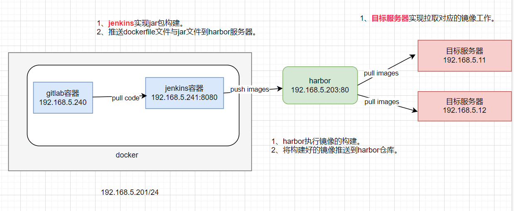

# Jenkins实现CI持续集成总结

## 实现拓扑图

## 总结心得

Jenkins是自动化流水线的桥梁。可以这么说jenkins的出现完全改变了传统开发方式。

---

传统开发方式：

1、编码。（程序员自己完成）

2、本地运行测试。【没有问题】（程序员自己完成）

3、打包、构建镜像、预发布环境集成测试。【没有问题】（程序员自己完成）

4、生产环境上线。【在这个环境下可能有许多问题存在。】（程序员自己完成）

---

jenkins的开发方式：

1、编码。（程序员自己完成）

2、本地运行测试。【没有问题】（程序员自己完成）

3、打包、构建镜像、预发布环境集成测试。【没有问题】（jenkins完成、程序员只关心测试结果）

4、生产环境上线。【在这个环境下可能有许多问题存在。】（jenkins完成、程序员只关心测试结果）

Jenkins实现了构建、发布的自动化。

