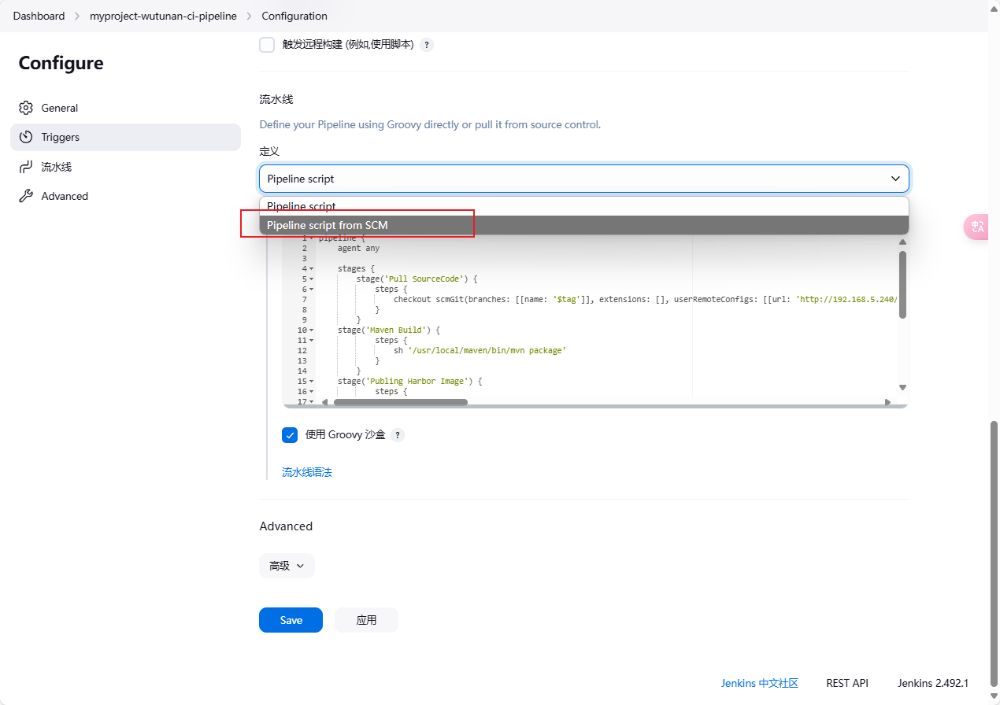
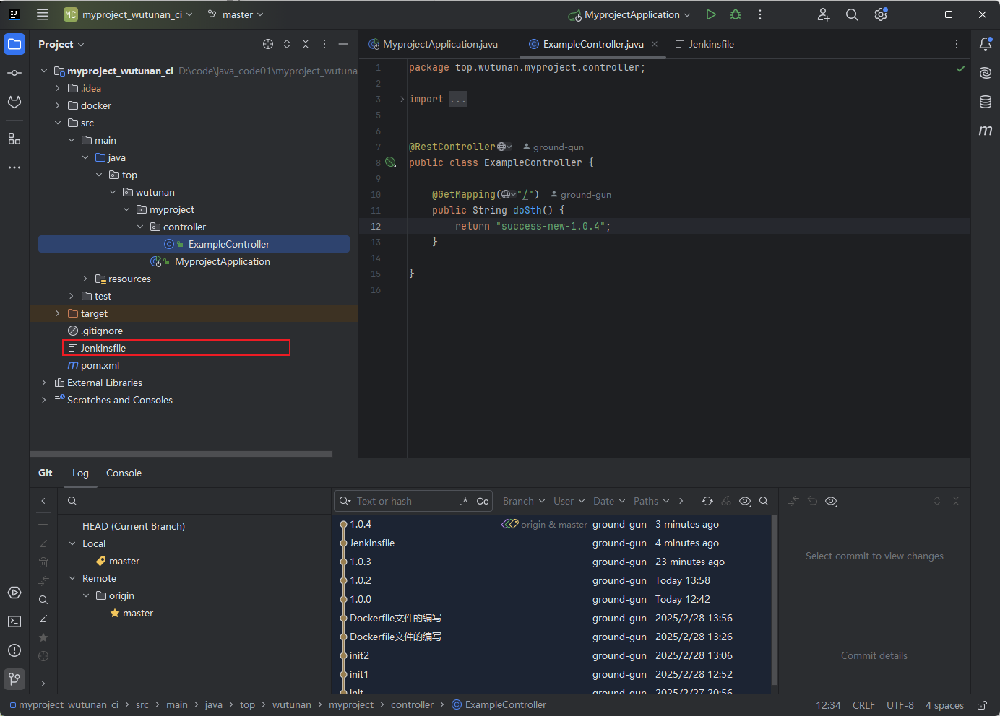
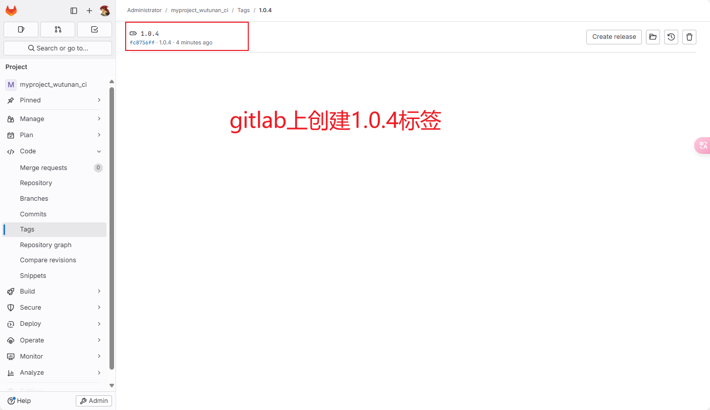
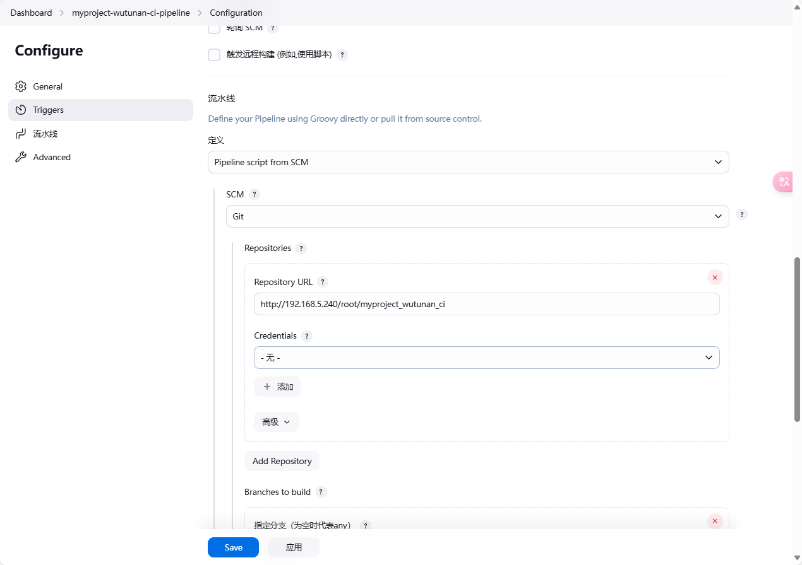
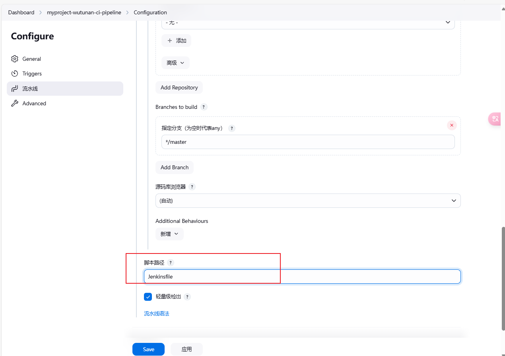
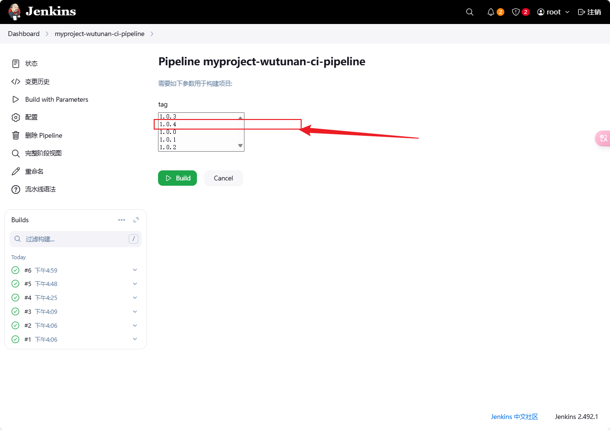
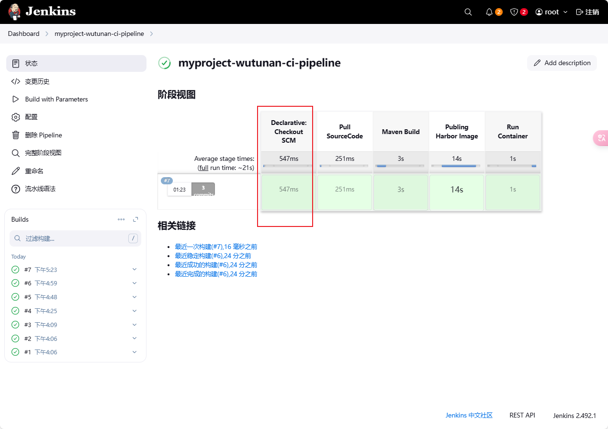

# Gitlab托管Jenkinsfile

之前是通过流水脚本来做构建发布的工作。

但是这个工作有一个问题。流水脚本是保存在jenkins里面的。

一个好的做法就是这个脚本我们保存在项目的gitlab中。

一方面gitlab是一个稳定的数据存储。gitlab的文件是存储可靠的。

一方面版本的变更与迭代的作用。

## 第一)项目中创建Jenkinsfile

注意：要在项目的根目录下进行创建。

## 第二)jenkins的流水线配置

## 第三)开始构建与发布

