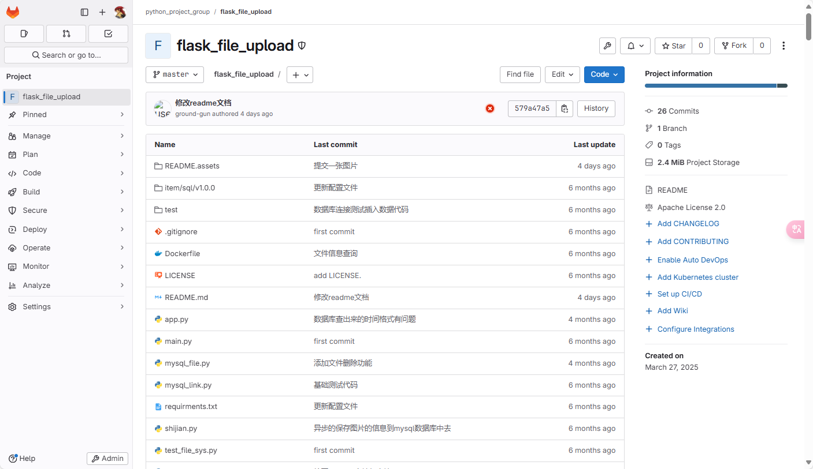
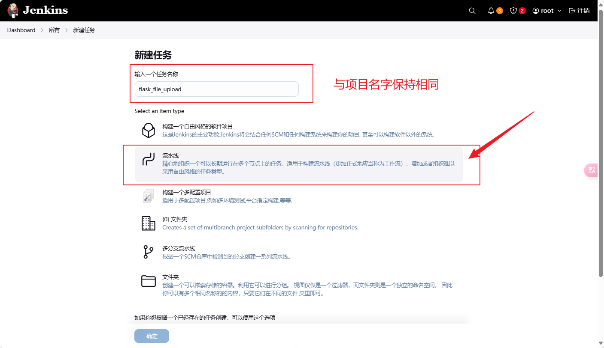
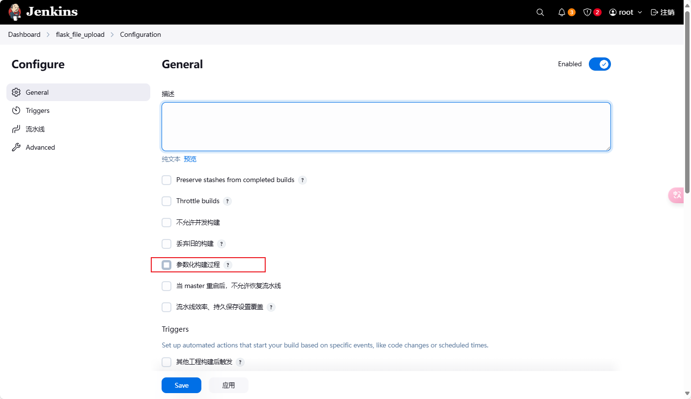
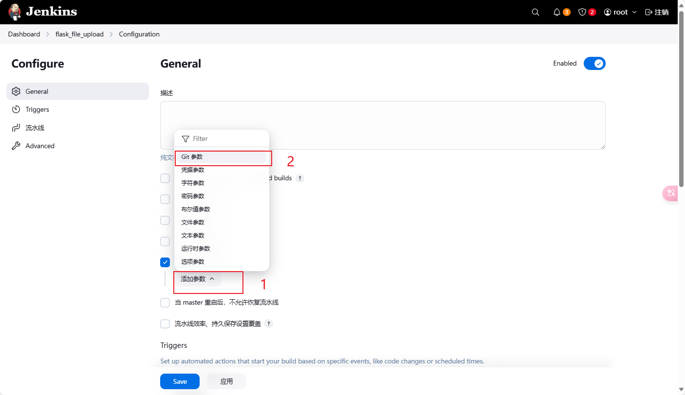
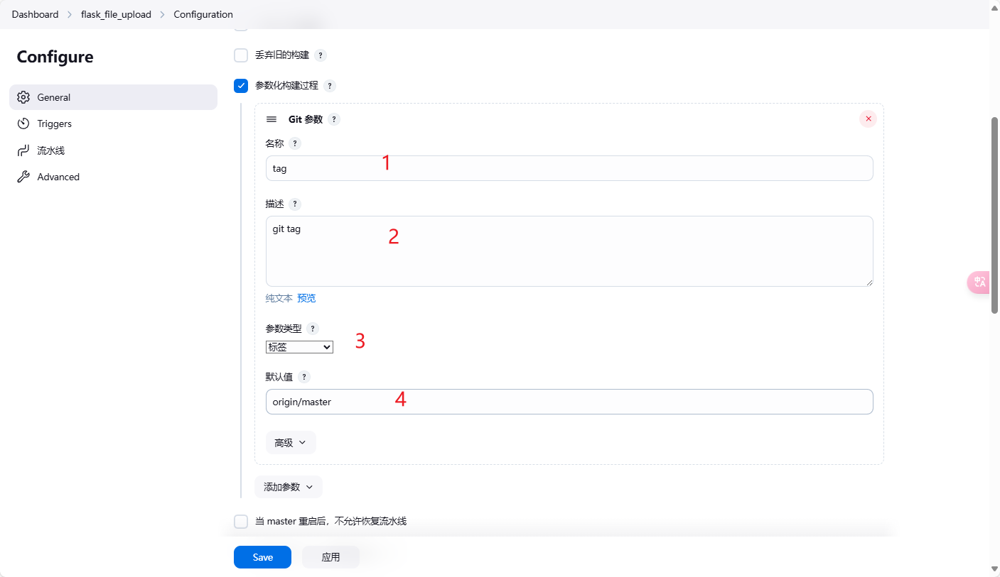
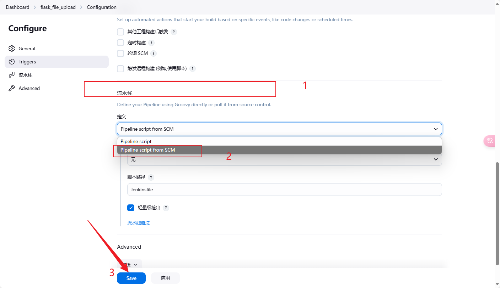
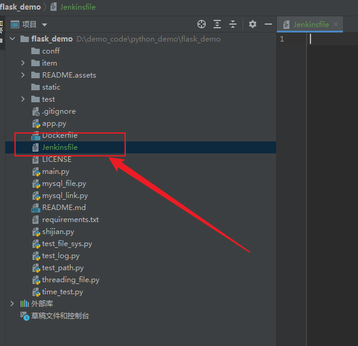
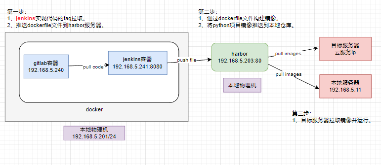

# python项目构建流水线

## 项目介绍

项目的名字：flask_file_upload

## jenkins创建新任务

## 流水线脚本构建

1. 第一步：在jenkins上勾选脚本构建流水线。

2. 第二步：在python的项目根目录下创建Jenkins流水线脚本文件。

3. 第三步：编写构建流水线的脚本。整个构建流程是怎么样的？可以参照如下图：

流水线构建的步骤编写请关注下一回。python项目流水线脚本。

