# python项目流水线脚本

## 第一步)拉取源代码


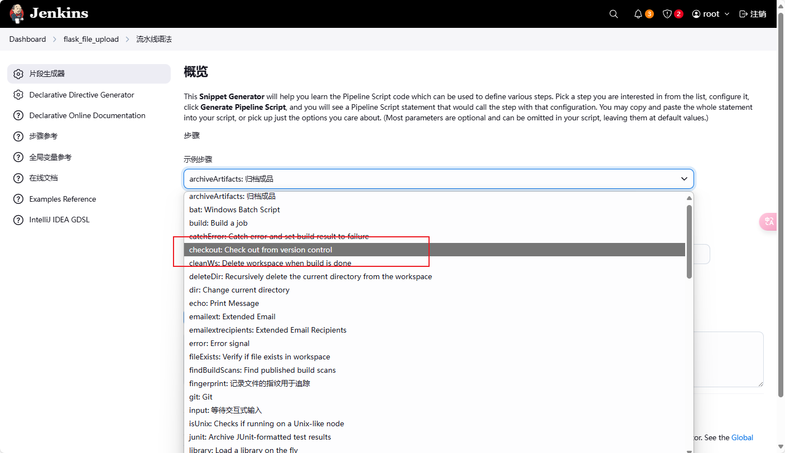


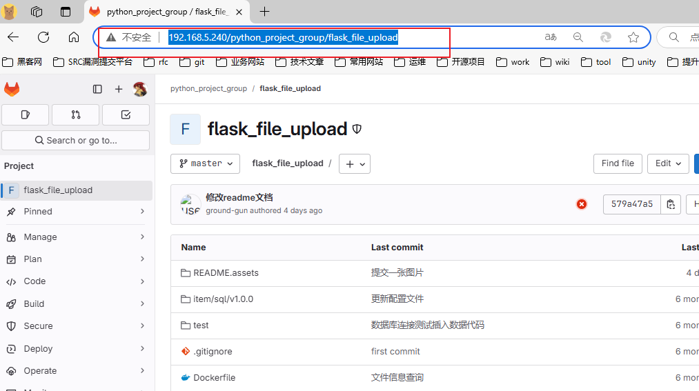


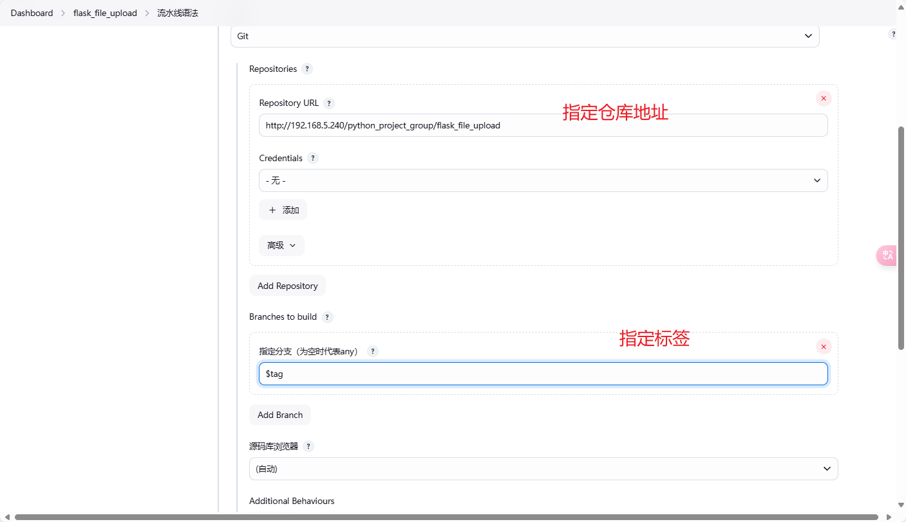


## 第二步)构建镜像

在构建镜像前有前提就是要配置远程连接的服务器。


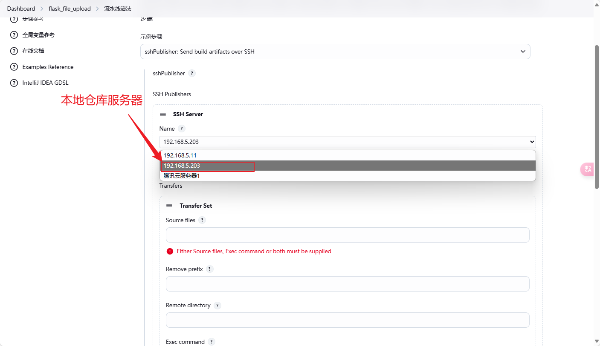


**Source files属性填写：**

| 属性值 | 描述                         |
| :----- | ---------------------------- |
| `**/*` | 表示匹配任意层级目录下的文件 |
|        |                              |
|        |                              |

`**/*`的效果如下：


项目的目录结构：


**Remote directory的属性填写：**

| 属性值                         | 描述                       |
| ------------------------------ | -------------------------- |
| `/usr/local/flask_file_upload` | 有问题的写法。效果如下图： |
|                                |                            |
|                                |                            |


`/usr/local/flask_file_upload`的写法效果图如下：


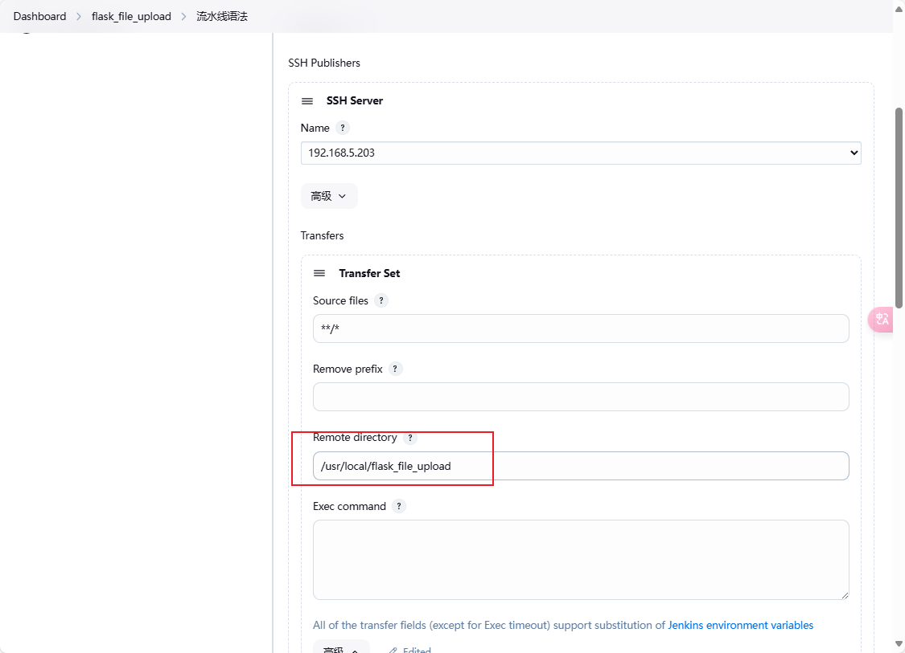


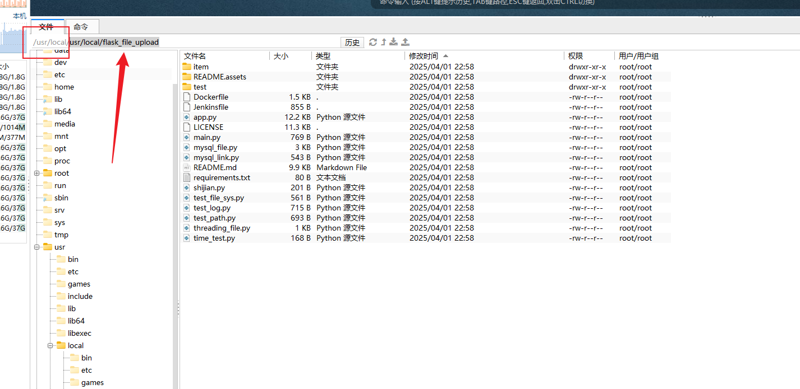


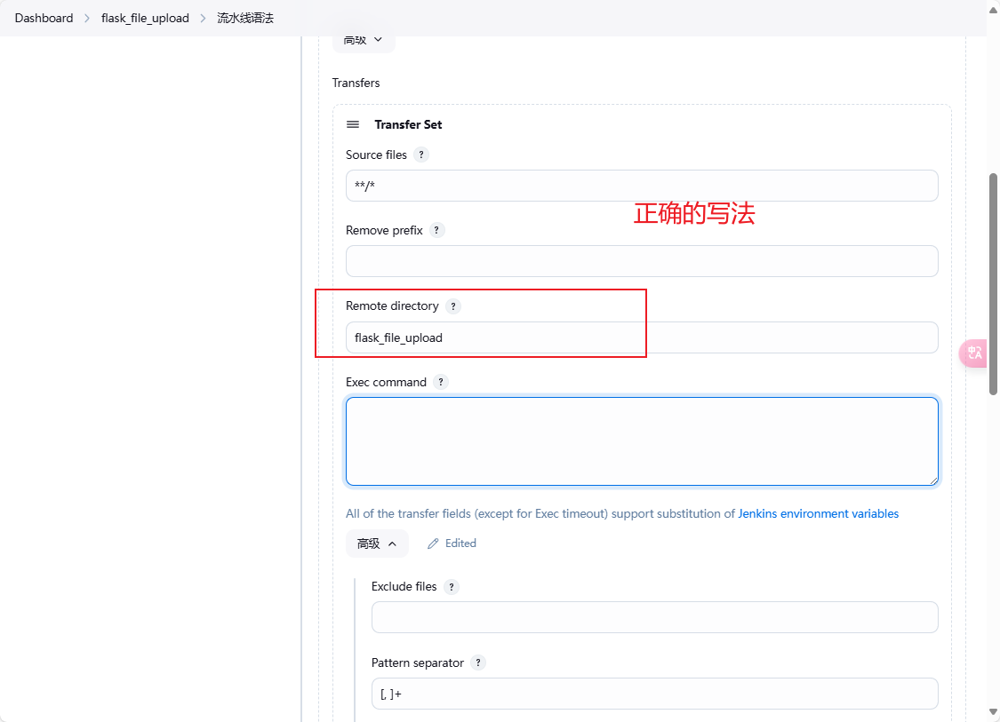


`flask_file_upload`的写法效果图如下：


::: tip总结

传输文件到目标主机服务器的路径是：/usr/local  +  自己定义的路径。

:::


构建的命令：

```shell
docker build  --network host -t 192.168.5.203:80/public/flask_file_upload:$tag /usr/local/flask_file_upload
docker login -u admin -p Harbor12345 192.168.5.203:80
docker push 192.168.5.203:80/public/flask_file_upload:$tag
```


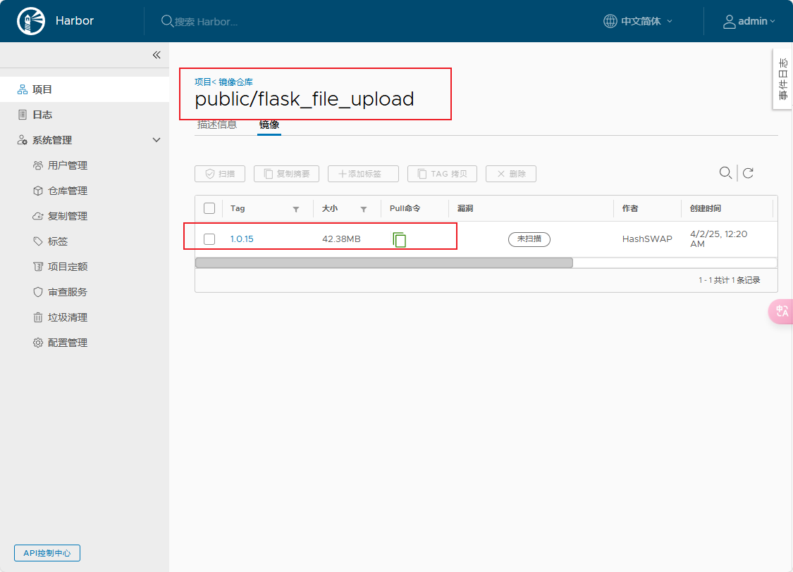


## 第三步)目标服务器拉取镜像


## 问题


问题一：

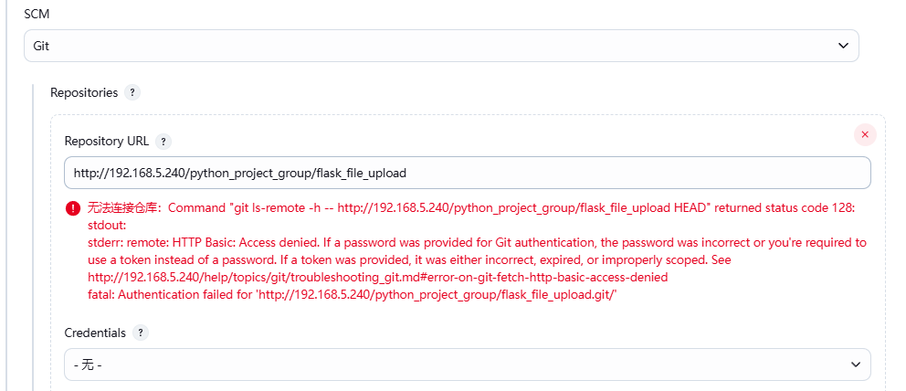


```
无法连接仓库：Command "git ls-remote -h -- http://192.168.5.240/python_project_group/flask_file_upload HEAD" returned status code 128:
stdout:
stderr: remote: HTTP Basic: Access denied. If a password was provided for Git authentication, the password was incorrect or you're required to use a token instead of a password. If a token was provided, it was either incorrect, expired, or improperly scoped. See http://192.168.5.240/help/topics/git/troubleshooting_git.md#error-on-git-fetch-http-basic-access-denied
fatal: Authentication failed for 'http://192.168.5.240/python_project_group/flask_file_upload.git/'
```


无法连接仓库连接仓库为什么呢？

解决：


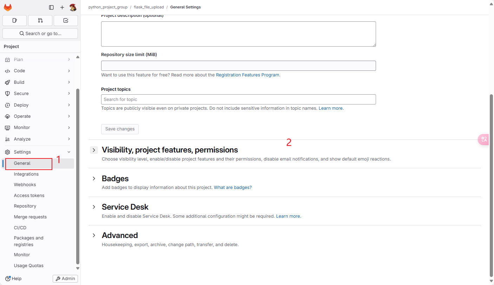


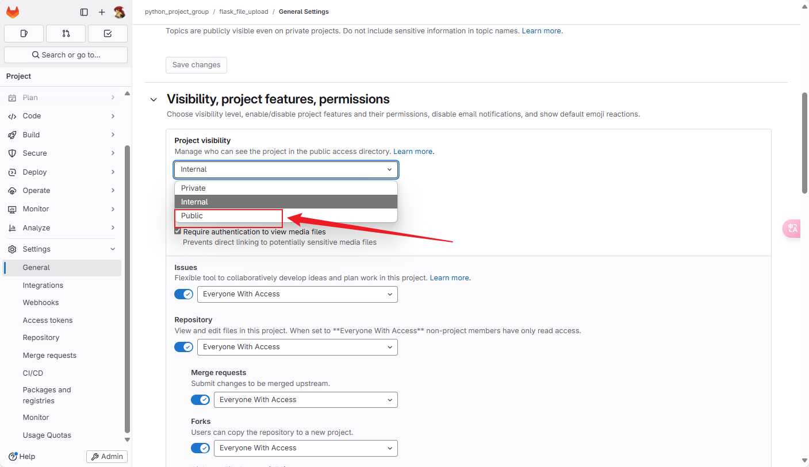


**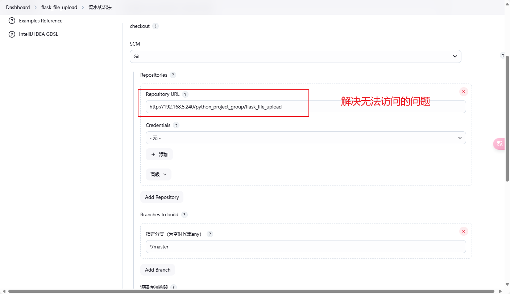**


问题2：

在执行构建python的镜像的时候:

```shell
docker build -t 192.168.5.203:80/public/flask_file_upload:1.0.0 /usr/local/flask_file_upload
```


为什么无法连接下载呢？我个人在windows的docker都能正常的构建。

问题的分析：

1. 可能是没有换源。我当前部署在linux的系统上。
2. 我windows的依赖下载可能都是通过走魔法进行下载的。

```
 > [9/9] RUN pip install -r requirements.txt:                                                                                                                                                                                                                                                                                                      
0.613 Looking in indexes: http://mirrors.aliyun.com/pypi/simple                                                                                                                                                                                                                                                                                    
5.625 WARNING: Retrying (Retry(total=4, connect=None, read=None, redirect=None, status=None)) after connection broken by 'NewConnectionError('<pip._vendor.urllib3.connection.HTTPConnection object at 0x7f231582f7d0>: Failed to establish a new connection: [Errno -3] Try again')': /pypi/simple/flask/                                         
11.13 WARNING: Retrying (Retry(total=3, connect=None, read=None, redirect=None, status=None)) after connection broken by 'NewConnectionError('<pip._vendor.urllib3.connection.HTTPConnection object at 0x7f23157f4290>: Failed to establish a new connection: [Errno -3] Try again')': /pypi/simple/flask/                                         
17.14 WARNING: Retrying (Retry(total=2, connect=None, read=None, redirect=None, status=None)) after connection broken by 'NewConnectionError('<pip._vendor.urllib3.connection.HTTPConnection object at 0x7f23157f4750>: Failed to establish a new connection: [Errno -3] Try again')': /pypi/simple/flask/                                         
24.15 WARNING: Retrying (Retry(total=1, connect=None, read=None, redirect=None, status=None)) after connection broken by 'NewConnectionError('<pip._vendor.urllib3.connection.HTTPConnection object at 0x7f23157f4c10>: Failed to establish a new connection: [Errno -3] Try again')': /pypi/simple/flask/
33.16 WARNING: Retrying (Retry(total=0, connect=None, read=None, redirect=None, status=None)) after connection broken by 'NewConnectionError('<pip._vendor.urllib3.connection.HTTPConnection object at 0x7f231584ead0>: Failed to establish a new connection: [Errno -3] Try again')': /pypi/simple/flask/
```

主要原因是：容器的内部环境网络无法连接使用。(大概是这个意思)

问题的解决：

```
 docker build --network host -t 192.168.5.203:80/public/flask_file_upload:1.0.0 /usr/local/flask_file_upload
```

`--network host`是表示**使用宿主网络构建**。

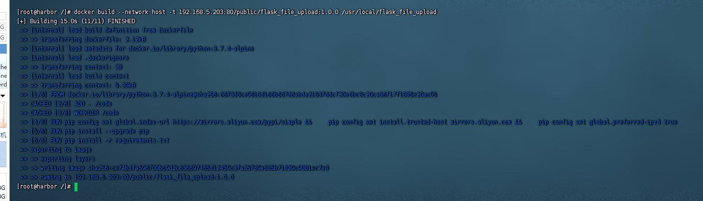

在centos上构建构成全部通过。


问题三：


```
[root@VM-8-4-centos ~]# docker pull www.tc03vd.top:9001/public/flask_file_upload:1.0.16
Error response from daemon: Get "https://www.tc03vd.top:9001/v2/": http: server gave HTTP response to HTTPS client
[root@VM-8-4-centos ~]# docker pull 43.136.124.89:9001/public/flask_file_upload:1.0.16
Error response from daemon: Get "https://43.136.124.89:9001/v2/": http: server gave HTTP response to HTTPS clien
```


