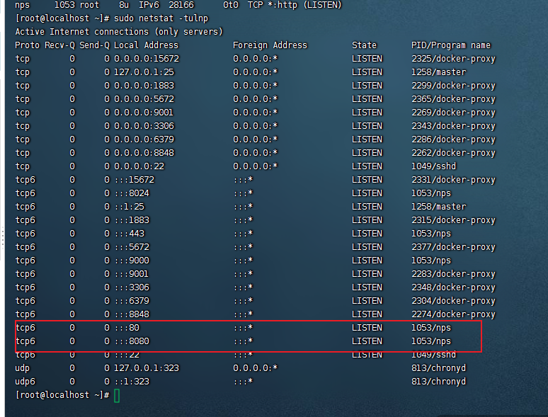

# 端口谁在用？

要查看CentOS系统中哪些端口正在被使用以及哪个进程在使用它们，你可以使用以下几种方法：


## 使用netstat命令

常用选项：

- `-t`：显示TCP端口
- `-u`：显示UDP端口
- `-l`：仅显示监听端口
- `-n`：以数字形式显示地址和端口号
- `-p`：显示进程ID和名称

```
sudo netstat -tulnp
```


案例：查看80端口谁在使用。




## 检查特定端口的使用情况

格式：

```
sudo lsof -i :端口号
```

案例：

```
# 例如检查80端口
sudo lsof -i :80
```


sudo lsof -i :端口号的i是什么意思？

`-i` 选项详解：

- **`-i`** 表示 `lsof` 只显示与网络相关的进程（TCP/UDP 连接）。
- 可以单独使用 `-i` 列出所有网络连接：

```
sudo lsof -i
```

- 也可以指定协议（TCP/UDP）或端口号：
  - **`-i TCP`** 只显示 TCP 连接
  - **`-i UDP`** 只显示 UDP 连接
  - **`-i :80`** 只显示使用 80 端口的进程
  - **`-i @1.2.3.4`** 只显示与 IP `1.2.3.4` 相关的连接
  - **`-i :ssh`** 也可以直接使用服务名（如 `ssh` 对应 22 端口）


