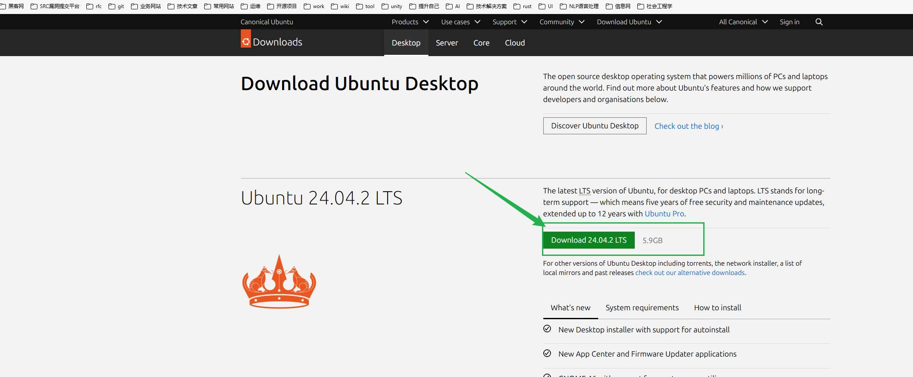

# ubuntu镜像下载

创作时间：2025-02-21

[Download Ubuntu Desktop | Ubuntu](https://ubuntu.com/download/desktop)

LTS是什么意思？

答：LTS是“Long Term Support”的缩写，意为长期支持。

为什么要选择LTS版的呢？

答：Ubuntu官方会为其提供长达五年的安全更新和维护支持。这样的版本适合需要稳定运行环境的用户和企业使用。

## what's new

有什么新功能？

- New Desktop installer with support for autoinstall（支持自动安装的新桌面安装程序）
- New App Center and Firmware Updater applications（新的App Center和固件更新程序应用程序）
- GNOME 46 with support for quarter screen tiling（GNOME 46支持四分之一屏幕平铺GNOME 46支持四分之一屏幕平铺）
- Advanced Active Directory Group Policy Object support for Ubuntu Pro users（Ubuntu Pro用户的高级Active Directory组策略对象支持）
- Experimental support for TPM-backed Full Disc Encryption and ZFS encryption（对TPM支持的全盘加密和ZFS加密的实验支持）

## system requirements

系统要求

- 2 GHz dual-core processor or better（2 GHz双核处理器或更高）
- 4 GB system memory（4 GB系统内存）
- 25 GB of free hard drive space（25 GB可用硬盘空间）
- Either a USB port or a DVD drive for the installer media（用于安装介质的USB端口或DVD驱动器）
- Internet access is helpful（互联网接入很有帮助）

## how to install

怎么去安装？

To install or try Ubuntu Desktop:（要安装或尝试Ubuntu桌面：）

1. Download the ISO image（下载ISO映像）
2. Create a bootable USB flash drive with [balenaEtcher](https://etcher.balena.io/) or similar（使用balenaEtcher或类似工具创建可引导的USB闪存驱动器）
3. Boot your laptop or PC from the USB flash drive（从USB闪存盘启动笔记本电脑或PC）

