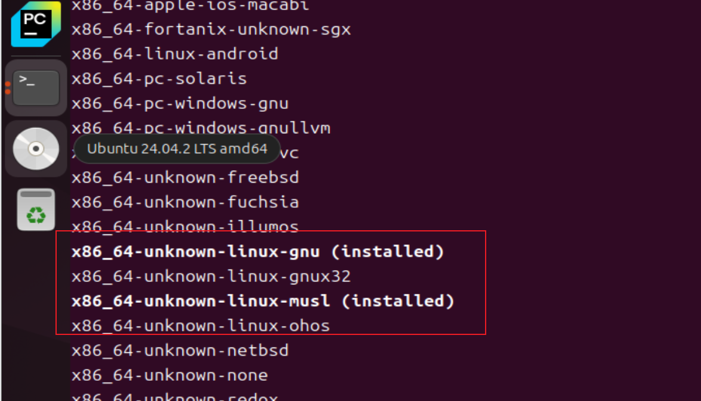

# rust的linux程序编译

## musl与glibc 的区别

- Rust 默认安装的是 `glibc` 版本的工具链
- 当你指定 `musl` 目标时，需要单独安装对应的标准库

| 特性     | musl                      | glibc               |
| :------- | :------------------------ | :------------------ |
| 链接方式 | 静态链接                  | 动态链接            |
| 体积     | 较大                      | 较小                |
| 兼容性   | 跨Linux发行版（如Alpine） | 依赖特定glibc版本   |
| 常用场景 | 容器部署/跨平台分发       | 本地开发/同系统部署 |

**装musl目标工具链**

```shell
rustup target add x86_64-unknown-linux-musl
```

**验证安装**

```shell
rustup target list | grep musl
```



**重新编译**

```shell
cargo build --target x86_64-unknown-linux-musl
```

