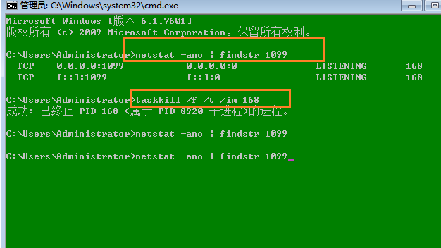

## 强制关闭端口号



- **第一步：查看端口号对应的进程id**

上面我们是要关闭1099端口号，使用如下命令过滤查看端口号对应的进程id

```xquery
netstat -ano | findstr 端口号
```

- **第二步：kill进程id**

```xquery
taskkill  /f /t /im 进程id
```


## windows文件不能删除

场景，不知道为什么电脑上文件怎么也不能删除，可以使用bat命令来删除

```xquery
DEL /F /A /Q \\?\%1
RD /S /Q \\?\%1
```

### 什么意思？

这是两个Windows命令，用于删除指定`路径下的文件和文件夹`。

DEL /F /A /Q \?%1：删除指定路径下的`所有文件`，包括只读文件和隐藏文件，不需要确认。

RD /S /Q \?%1：删除指定路径下的所有`文件夹及其子文件夹`，不需要确认。

### 符号表示什么意思？

符号的含义如下：

```xquery
/F：强制删除只读文件。
/A：删除指定路径下的所有文件，包括只读文件和隐藏文件。
/Q：不需要确认删除操作。
\?%1：指定要删除的路径，其中“\?\”表示使用长路径名格式，可以避免路径名过长而无法删除的问题。
RD：删除文件夹的命令。
/S：删除指定路径下的所有子文件夹。
/Q：不需要确认删除操作。
```

### 都是什么单词缩写？

这些单词缩写的含义如下：

```xquery
DEL：delete（删除）
/F：force（强制）
/A：all（所有）
/Q：quiet（静默）
RD：remove directory（删除目录）
/S：subdirectories（子目录）
/Q：quiet（静默）
```

