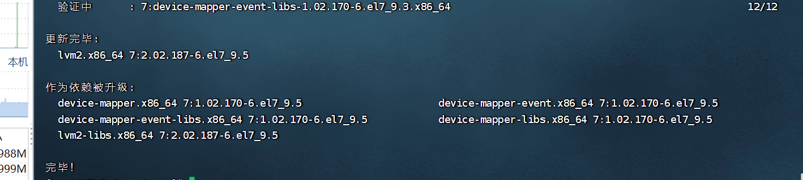
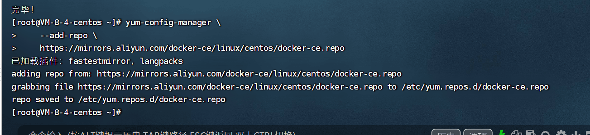
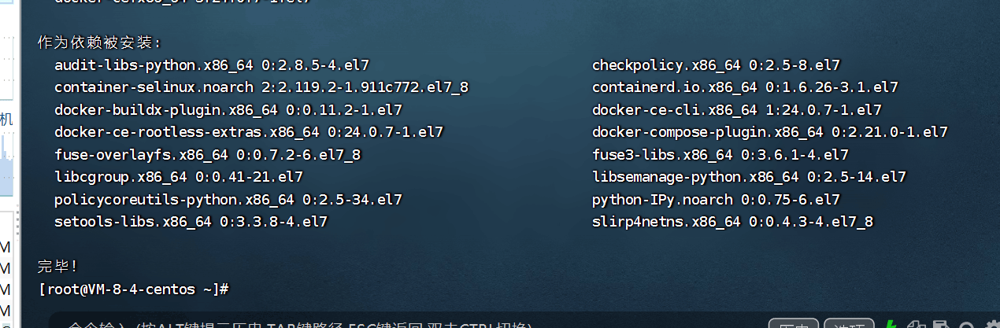
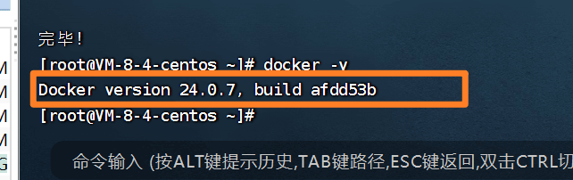
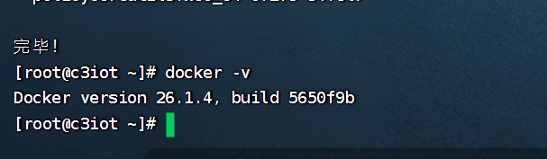
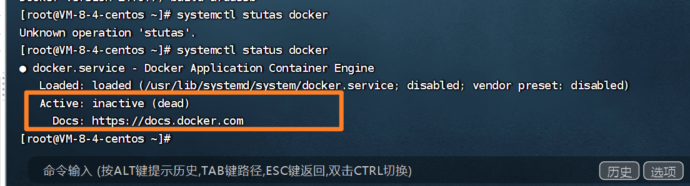
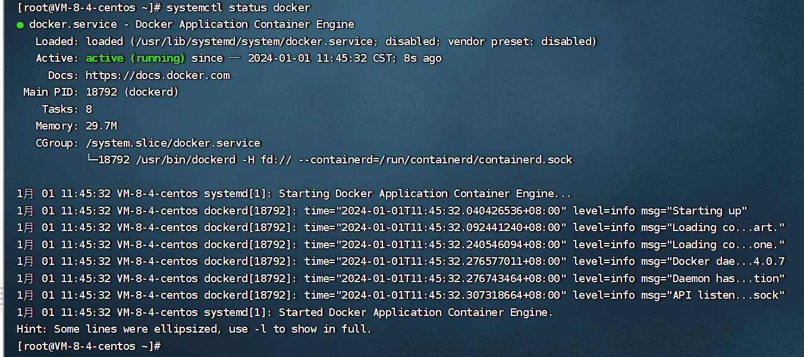

# 02)centOS安装docker

## 卸载（可选）

如果之前安装过旧版本的Docker，可以使用下面命令卸载：

```shell
yum remove docker \
                  docker-client \
                  docker-client-latest \
                  docker-common \
                  docker-latest \
                  docker-latest-logrotate \
                  docker-logrotate \
                  docker-selinux \
                  docker-engine-selinux \
                  docker-engine \
                  docker-ce
```


## 安装docker准备

首先需要大家虚拟机联网，安装yum工具。

```shell
yum install -y yum-utils \
           device-mapper-persistent-data \
           lvm2 --skip-broken
```



## 更新本地镜像源

- 设置docker镜像源

```shell
yum-config-manager \
    --add-repo \
    https://mirrors.aliyun.com/docker-ce/linux/centos/docker-ce.repo
```



- 第二条

```shell
sed -i 's/download.docker.com/mirrors.aliyun.com\/docker-ce/g' /etc/yum.repos.d/docker-ce.repo
```


## 安装docker

```
yum install -y docker-ce
```

docker-ce为社区免费版本。稍等片刻，docker即可安装成功。




## 验证安装

```shell
 docker -v
```




2025年的2月27日再次执行：`yum install -y docker-ce`命令默认安装的是最新版docker。



::: tip 扩展下

怎么在安装时指定要安装的版本呢？（问AI）

:::

## 检查docker状态

```shell
systemctl status docker 
```



- 是关闭的状态。


## 启动docker

