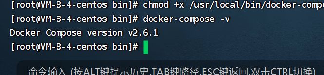

## 03)centos安装dockerCompose


## 通过上传包安装


传到`/usr/local/bin/`目录。

```shell
cd  /usr/local/bin/
```

::: tip  题问题

- 问：docker-compose文件哪里下载呢？

  答：通过网盘分享的文件：docker-compose1.29.1
  链接: https://pan.baidu.com/s/1BHKnQZj6349exelO26Tdzg?pwd=u916 提取码: u916 
  --来自百度网盘超级会员v4的分享
  
  docker-compose的版本在2以上地址：
  
  通过网盘分享的文件：docker-compose2.6.1
  链接: https://pan.baidu.com/s/1AFbyhyn-at-VYhgfk0btcg?pwd=srx2 提取码: srx2 
  --来自百度网盘超级会员v4的分享

:::

## 修改文件权限

- 修改权限

```shell
chmod +x /usr/local/bin/docker-compose
```

## 验证安装

```shell
docker-compose -v
```




2025年2月17日我使用的docker-compose文件的版本如下：

```shell
[root@c3iot bin]# docker-compose -v
docker-compose version 1.29.1, build c34c88b2
[root@c3iot bin]# 
```


