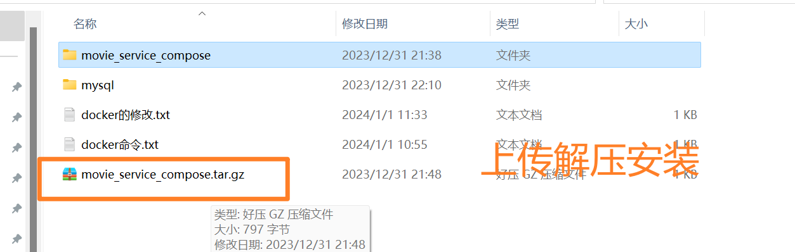
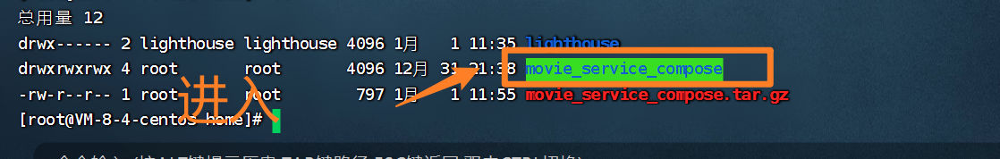
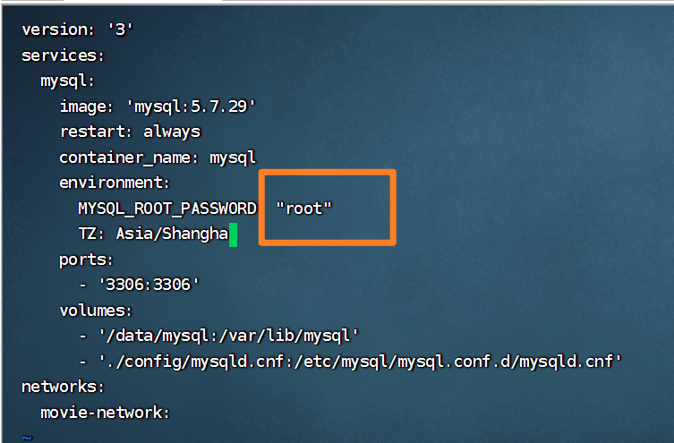
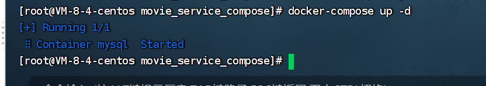

# 04)dockerCompose安装mysql




## 解压

```shell
tar -zxvf movie_service_compose.tar.gz
```



- 注意：要进入这个目录movie_service_compose启动。


## 修改下密码

```shell
 vi docker-compose.yml 
```

不要使用默认密码root。防止弱口令爆破。




## 启动拉取镜像

