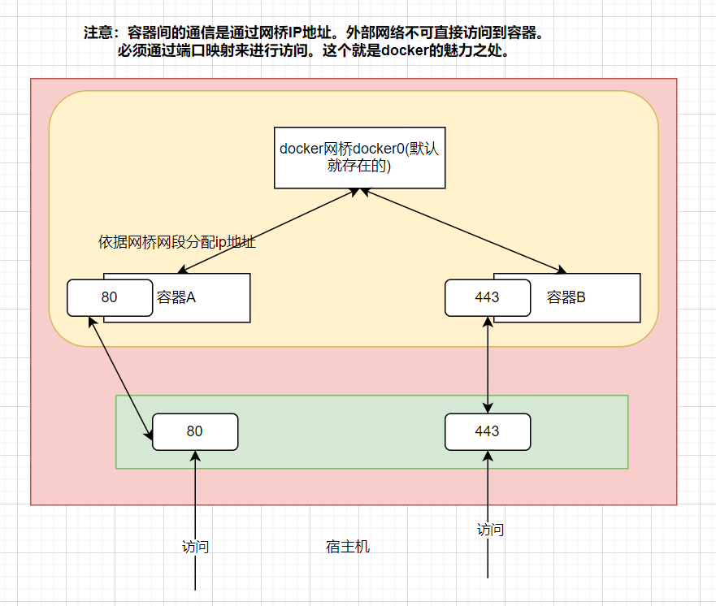

# 论docker网桥模式

## 我的疑惑

docker的网桥模式原理是什么样的呢？

什么是网桥呢？

## 什么是docker网桥？

Docker使用Linux桥接，在宿主机虚拟一个Docker容器网桥(docker0)，Docker启动一个容器时会根据Docker网桥的网段分配给容器一个IP地址，称为Container-IP，同时Docker网桥是每个容器的默认网关。因为在同一宿主机内的容器都接入同一个网桥，这样容器之间就能够通过容器的Container-IP直接通信。

Docker网桥是宿主机虚拟出来的，并不是真实存在的网络设备，外部网络是无法寻址到的，这也意味着外部网络无法通过直接Container-IP访问到容器。

如果容器希望外部访问能够访问到，可以通过映射容器端口到宿主主机（端口映射），即docker run创建容器时候通过 -p 或 -P 参数来启用，访问容器的时候就通过[宿主机IP]:[容器端口]访问容器。

上面这张图大概是上面文字描述的理解。

总结：

网桥就相当于一个交换机。负责主机上面的全部容器通过这个交换机（网桥）连接在了一个二层网络。

## Bridge网络模式特点

为每一个容器分配、设置IP。

将容器连接到一个docker0虚拟网桥。

通过docker0网桥以及Iptables nat表配置与宿主机通信。

