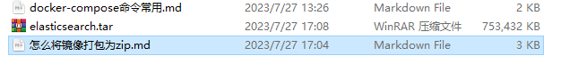

## docker这么将镜像打包到本地？

要将Docker镜像打包出来并再次加载和启动，可以按照以下步骤进行操作：

### **步骤一：打包镜像**

1. 确保你已经在构建好的镜像上进行了修改或者有需要导出的镜像。

2. 使用

   ```
   docker save
   ```

   命令将镜像打包成一个tar归档文件：

   ```
   docker save -o image.tar IMAGE_NAME:TAG
   ```

   如下：

   ```bash
    docker save -o elasticsearch.tar docker.elastic.co/elasticsearch/elasticsearch:7.9.2
   ```

   

   其中，

   ```
   IMAGE_NAME
   ```

   是要导出的镜像的名称，

   ```
   TAG
   ```

   是对应的标签。

### 扩展

**步骤二：加载镜像**

1. 将打包的镜像加载回Docker中，使用

   ```
   docker load
   ```

   命令：

   ```
   docker load -i image.tar
   ```

**步骤三：启动容器**

1. 确保你已经加载了所需的镜像。

2. 使用

   ```
   docker run
   ```

   命令启动容器：

   ```
   docker run [OPTIONS] IMAGE_NAME:TAG
   ```

   其中，

   ```
   IMAGE_NAME
   ```

   是要运行的镜像的名称，

   ```
   TAG
   ```

   是对应的标签。

请注意，打包的镜像文件可以通过各种方式进行传输和共享，比如拷贝到另一台机器上、上传到容器注册表（Container Registry）等。加载镜像后，你可以像往常一样使用`docker run`来启动容器。

记得替换命令中的`IMAGE_NAME`和`TAG`为实际的镜像名称和标签。希望这些步骤能帮助你成功打包、加载和启动Docker镜像。


**步骤二：使用zip工具打包tar文件** 你可以使用系统上已安装的zip工具或者第三方压缩软件来将tar文件打包成zip格式。以下是使用常见的Linux命令行zip工具的示例：

```
bashCopy code
zip image.zip image.tar
```

这将生成一个名为`image.zip`的zip文件，其中包含之前生成的`image.tar`文件。

现在，你就得到了一个包含Docker镜像的zip文件`image.zip`。你可以将此文件传输到其他机器上，并在其他机器上使用zip工具解压缩和加载镜像。

请注意，解压缩的zip文件中将包含之前生成的`image.tar`文件，你需要在目标机器上使用`docker load`命令来加载镜像：

```
bashCopy code
docker load -i image.tar
```

希望这样能帮助你将Docker镜像打包成zip文件，并在其他机器上加载。


