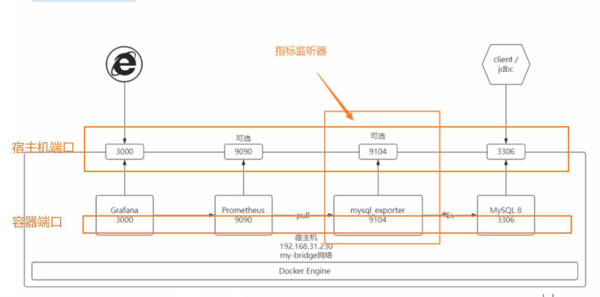
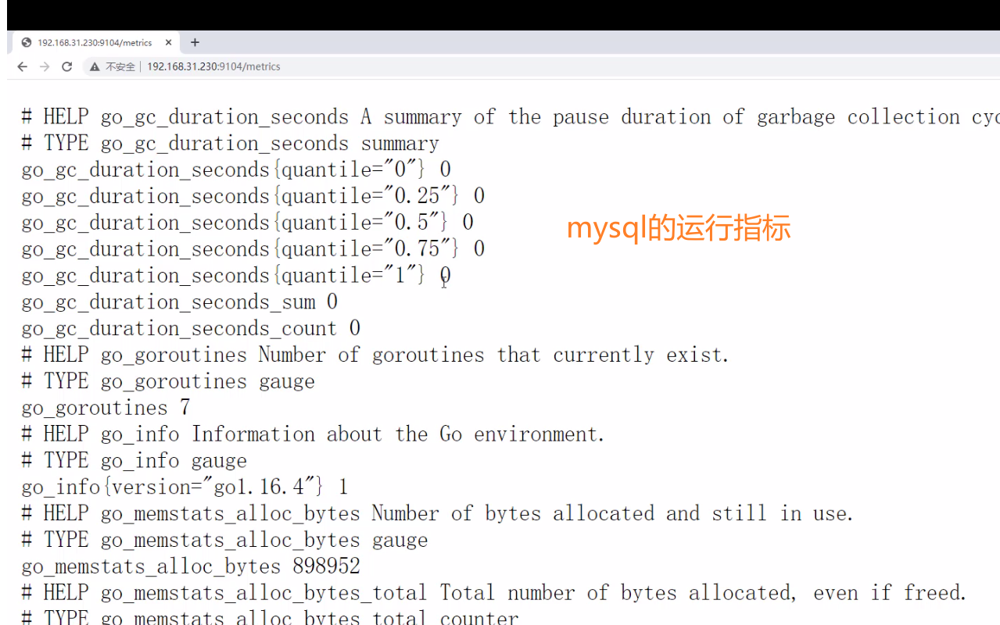
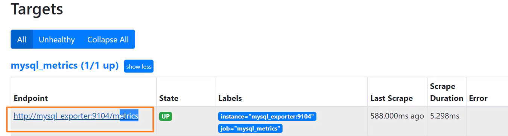
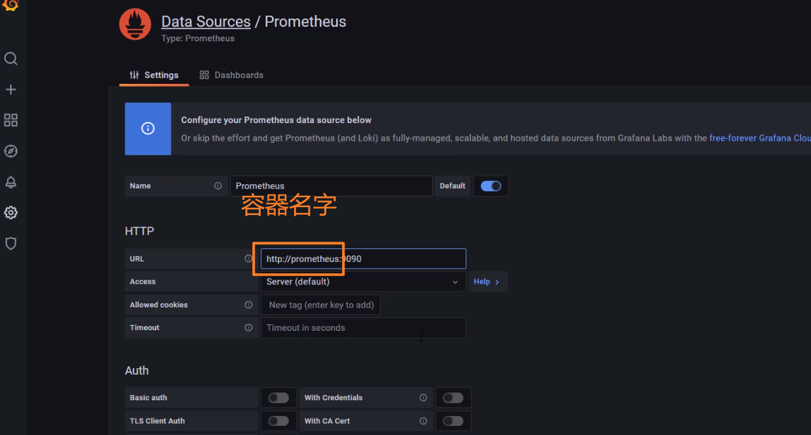
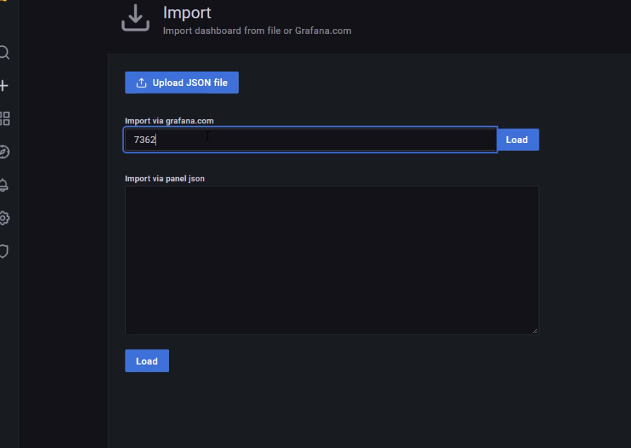

# 如何利用Docker快速构建基于Prometheus的MySQL监控系统





1. mysql_exporter对mysql的状态指标抓取的过程。

## 创建一个网桥

```shel
docker network create -d bridge my-bridge 
```


## docker安装mysql


```
mkdir -p /etc/mysql/init.d
```


### 创建数据库

```
cat > /etc/mysql/init.d/schema.sql <<-'EOF'
SET NAMES utf8mb4;
SET @OLD_UNIQUE_CHECKS=@@UNIQUE_CHECKS, UNIQUE_CHECKS=0;
SET @OLD_FOREIGN_KEY_CHECKS=@@FOREIGN_KEY_CHECKS, FOREIGN_KEY_CHECKS=0;
SET @OLD_SQL_MODE=@@SQL_MODE, SQL_MODE='TRADITIONAL';

DROP SCHEMA IF EXISTS sakila;
CREATE SCHEMA sakila;
USE sakila;

--
-- Table structure for table `actor`
--

CREATE TABLE actor (
  actor_id SMALLINT UNSIGNED NOT NULL AUTO_INCREMENT,
  first_name VARCHAR(45) NOT NULL,
  last_name VARCHAR(45) NOT NULL,
  last_update TIMESTAMP NOT NULL DEFAULT CURRENT_TIMESTAMP ON UPDATE CURRENT_TIMESTAMP,
  PRIMARY KEY  (actor_id),
  KEY idx_actor_last_name (last_name)
) ENGINE=InnoDB DEFAULT CHARSET=utf8mb4;

CREATE USER remote@'%' IDENTIFIED with mysql_native_password BY 'remote';
grant all privileges on *.* to remote@'%';

-- create exporter user 
-- create user'exporter'@'%' identified by 'exporter';
-- GRANT PROCESS, REPLICATION CLIENT, SELECT ON *.* TO 'exporter'@'%';
-- flush privileges;
CREATE USER 'exporter'@'%' IDENTIFIED BY 'exporter';
GRANT PROCESS, REPLICATION CLIENT, SELECT ON *.* TO 'exporter'@'%';
GRANT SELECT ON performance_schema.* TO 'exporter'@'%';
flush privileges;
EOF
```


```
CREATE USER remote@'%' IDENTIFIED with mysql_native_password BY 'remote';
```


创建用户

创建一个exporter的用户，密码是exporter

```sql
CREATE USER 'exporter'@'%' IDENTIFIED BY 'exporter';

GRANT SELECT ON performance_schema.* TO 'exporter'@'%';
flush privileges;
EOF
```

授权

```sql
GRANT PROCESS, REPLICATION CLIENT, SELECT ON *.* TO 'exporter'@'%';
GRANT SELECT ON performance_schema.* TO 'exporter'@'%';
```


### 运行mysql容器

```shell
docker run \
    -p 3306:3306  \
    --network my-bridge  \
    --name db \
    -v /etc/mysql/init.d:/docker-entrypoint-initdb.d \
    -e MYSQL_ROOT_PASSWORD=root  \
    -d  mysql:8
```


注意：

​    --name db  这个是容器的名字。

容器与容器之间不在使用ip地址进行通信。容器名字标识符进行通信。


## 创建

```shell
docker run 
-d 
-p 9104:9104 
--network my-bridge 
--name mysql_exporter 
-e DATA_SOURCE_NAME="exporter:exporter@(db:3306)/sakila" prom/mysqld-exporter
```


## 放行端口

```shell
firewall-cmd --zone=public --add-port=3306/tcp --permanent
firewall-cmd --zone=public --add-port=9104/tcp --permanent
firewall-cmd --zone=public --add-port=3000/tcp --permanent
firewall-cmd --zone=public --add-port=9090/tcp --permanent
# 重新加载防火墙
firewall-cmd  --reload
```


- 访问


- mysql的指标数据




## 配置prometheus

```yaml
### 以下内容为SpringBoot应用配置
  - job_name: 'mysql_metrics'
    scrape_interval: 5s
    metrics_path: '/metrics'
    static_configs:
      - targets: ['mysql_exporter:9104']
```







7362：mysql的监控仪表盘。



